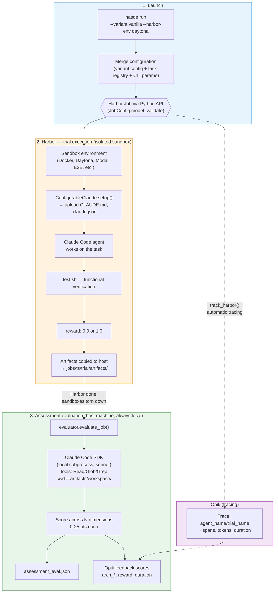
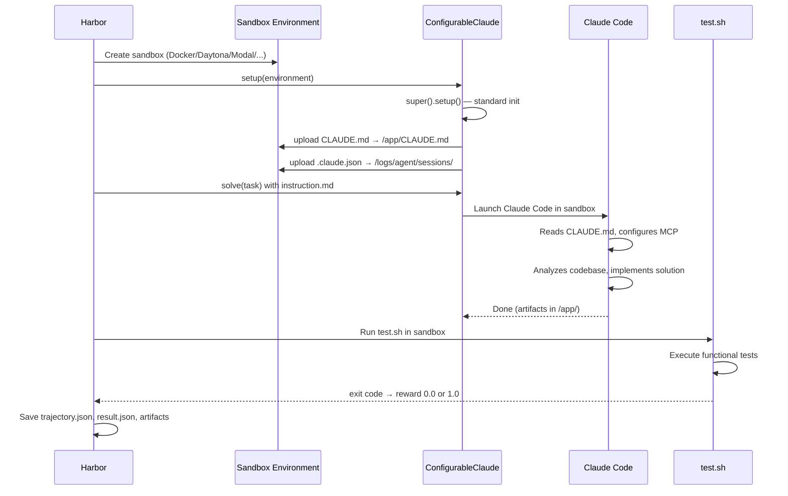
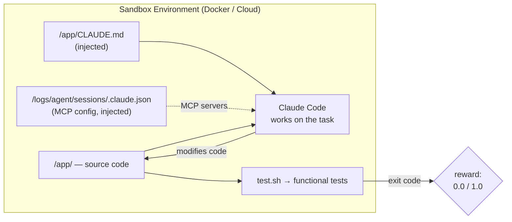
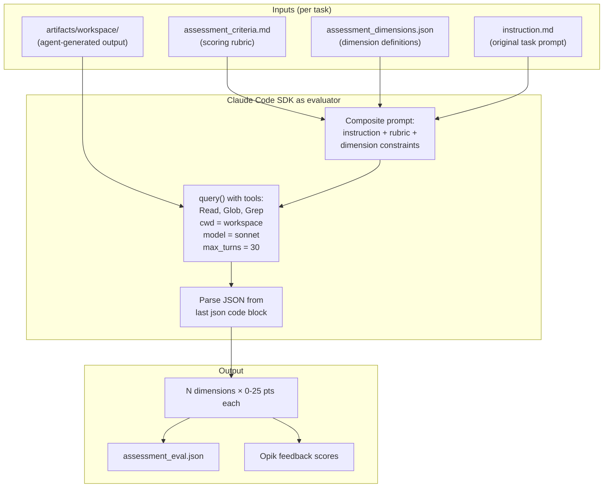
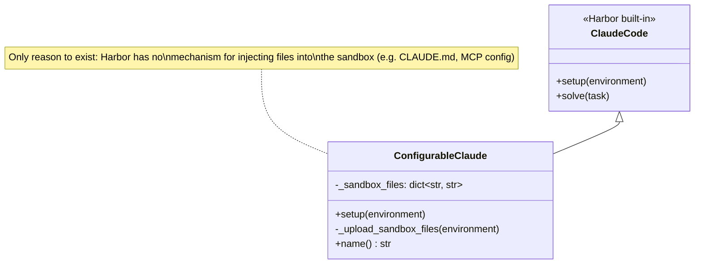
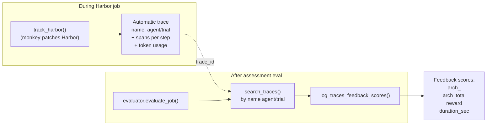
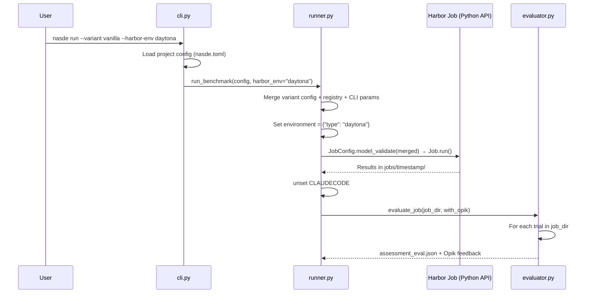

# NASDE Toolkit Architecture

## Overview

NASDE evaluates AI coding agents (e.g. Claude Code) on programming tasks. It uses **Harbor** as the execution engine running agents in isolated sandbox environments and **Opik** as the observability platform for tracking results.

Key design: evaluation is **two-stage** — Harbor assesses functional correctness (tests pass/fail), then a separate reviewer agent (Claude Code SDK) assesses architectural quality of the generated code.

---

## End-to-end flow



---

## What happens inside Harbor

Harbor is a framework for evaluating AI agents. You provide an agent, a dataset, and run a job. NASDE adds minimal but important customizations on top.

### Trial lifecycle



### Inside the sandbox



Harbor only measures **functional correctness** — tests pass or fail, yielding a binary reward. Whether the agent wrote the code *well* is not something Harbor measures. That's where assessment evaluation comes in.

---

## Cloud sandbox providers

Harbor supports multiple execution environments. The provider is set at the **job level** — all trials in a job use the same environment.

| Provider | `--harbor-env` value | Use case |
|----------|---------------------|----------|
| Docker | `docker` (default) | Local development, small runs |
| Daytona | `daytona` | Horizontal scaling, recommended for production |
| Modal | `modal` | Serverless execution |
| E2B | `e2b` | Sandboxed environments |
| Runloop | `runloop` | Runloop platform |
| GKE | `gke` | Google Kubernetes Engine |

### How it works

NASDE passes the environment choice to Harbor's `JobConfig`:

```python
# In runner.py _build_merged_config()
if harbor_env:
    merged["environment"] = {"type": harbor_env}
```

Harbor's `EnvironmentFactory` creates the appropriate environment class based on `EnvironmentConfig.type`. All environments implement the same `BaseEnvironment` interface (`start`, `stop`, `upload_file`, `download_file`, `exec`), so agent code works identically regardless of the provider.

### What runs where

| Component | Where it runs |
|-----------|--------------|
| Harbor trial (agent + test.sh) | Sandbox (Docker or cloud) |
| Assessment evaluation (reviewer agent) | Host machine (always local) |
| Opik tracing | Host machine (API calls to Opik cloud) |

The assessment evaluator reads artifacts that Harbor already copied from the sandbox to `jobs/<ts>/<trial>/artifacts/workspace/` on the host filesystem. It does not need access to the sandbox.

---

## Assessment evaluation — LLM-as-a-Judge

This is NASDE's key extension beyond default Harbor. It runs **entirely on the host machine**, outside of Harbor. After Harbor finishes all trials and sandboxes are torn down, NASDE invokes `evaluator.evaluate_job()` as a separate step.



---

## ConfigurableClaude — the only custom agent class



Harbor natively handles auth, MCP servers, model selection, and timeout. `ConfigurableClaude` adds **one thing**: declarative file mapping from host to the sandbox via `sandbox_files` in `harbor_config.json`.

---

## Agent variants

Each benchmark defines its **own set of variants** — there are no globally shared variants. A variant represents a specific agent configuration to be compared against other variants on the same set of tasks.

Each variant is a directory under `variants/<variant-name>/` containing:
- `CLAUDE.md` — project instructions injected into `/app/CLAUDE.md` in the sandbox (required)
- `skills/` — skill snapshots, each `skills/<name>/SKILL.md` injected into `/app/.claude/skills/<name>/SKILL.md` (optional)
- `harbor_config.json` — agent import path + `sandbox_files` mapping (auto-generated if absent)
- `claude_config.json` — MCP server configuration (optional)

This mirrors a real Claude Code project where CLAUDE.md and `.claude/skills/` are separate concerns. Skills in variants are deterministic snapshots — copies of the skill at a specific point in time, not references to external sources.

Variants can differ along many axes: instruction specificity, skill combinations, tool access, constraints, prompting techniques.

---

## Opik integration



Two integration points:
1. **`track_harbor()`** — Opik's monkey-patch over Harbor. Automatically creates traces with agent steps, token usage, and duration
2. **`evaluate_job() --with-opik`** — finds the existing trace by name `agent_name/trial_name`, attaches feedback scores

---

## Orchestration — `nasde run`



The runner builds a **merged config** by combining:
- `variants/<name>/harbor_config.json` — agent definition (import path, sandbox_files)
- Task registry — discovered from `tasks/` directory
- CLI parameters — model, timeout, harbor_env, task filter

---

## Trial result structure

```
jobs/2026-03-12__14-30-00/
└── sample-task__vanilla__0/
    ├── result.json              # reward, duration, task_id, source
    ├── config.json              # Agent config used for this trial
    ├── assessment_eval.json     # LLM-as-a-Judge evaluation result
    ├── agent/
    │   └── trajectory.json      # ATIF: agent steps, tool calls, tokens
    └── artifacts/
        └── workspace/           # Modified files from /app/
```

---

## Package structure

```
src/nasde_toolkit/
  cli.py                   # Typer CLI (init, run, eval + harbor/opik pass-through)
  config.py                # nasde.toml + task.json parsing into dataclasses
  runner.py                # Harbor Python API — variant resolution, config merging, Job execution
  evaluator.py             # Post-hoc assessment via Claude Code SDK
  docker.py                # Docker environment helpers
  scaffold/                # Project scaffolding templates
  agents/
    configurable_claude.py # Harbor-compatible agent with sandbox file injection
```
