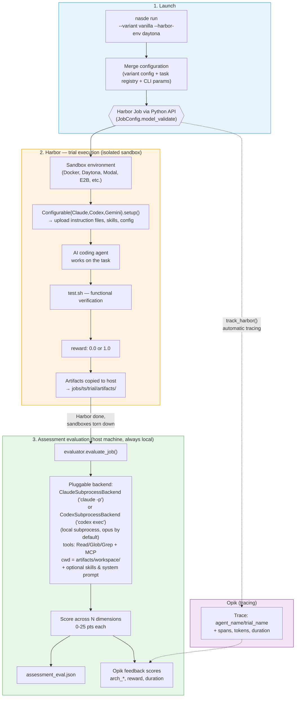
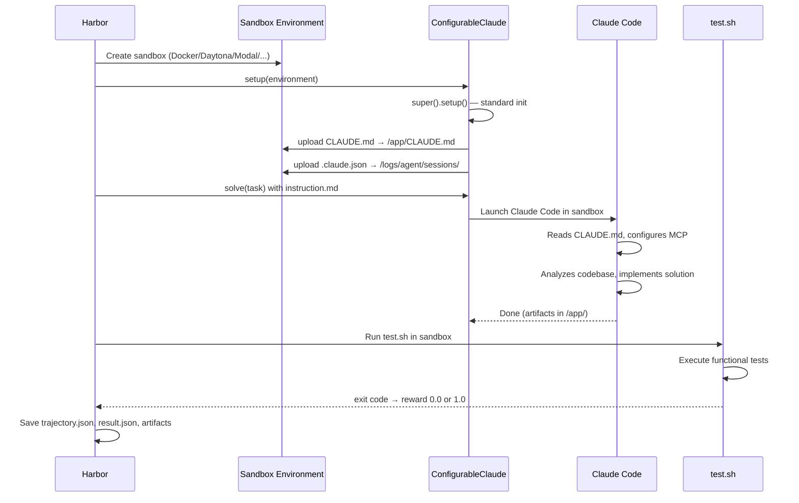
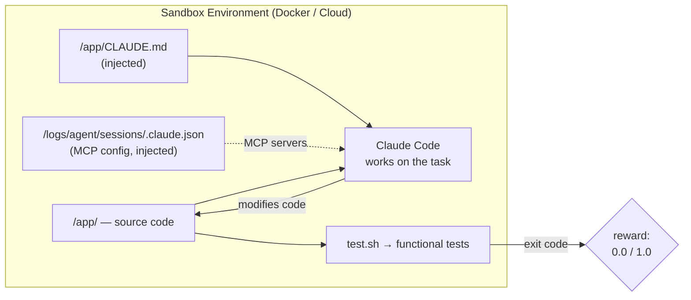
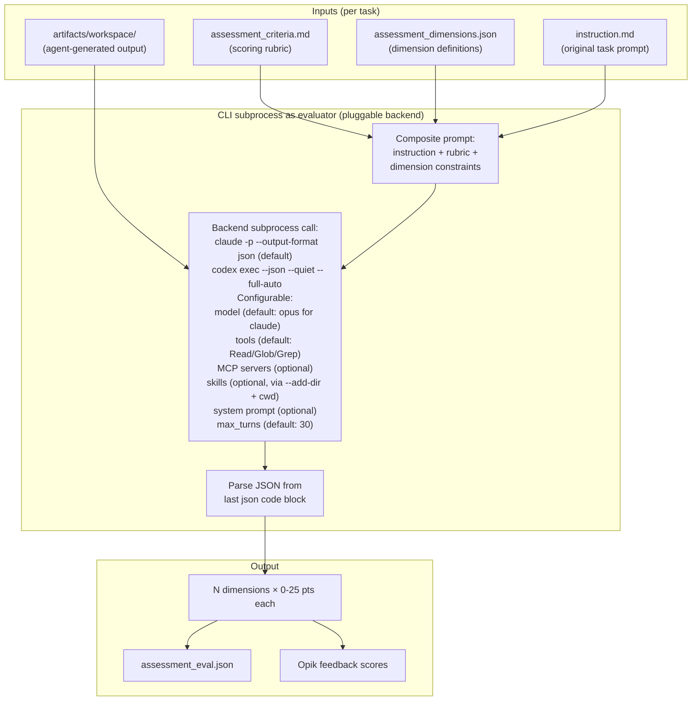
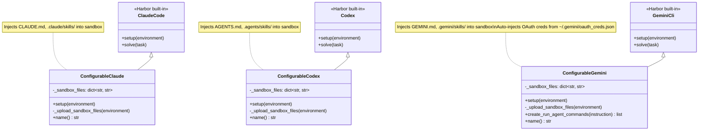
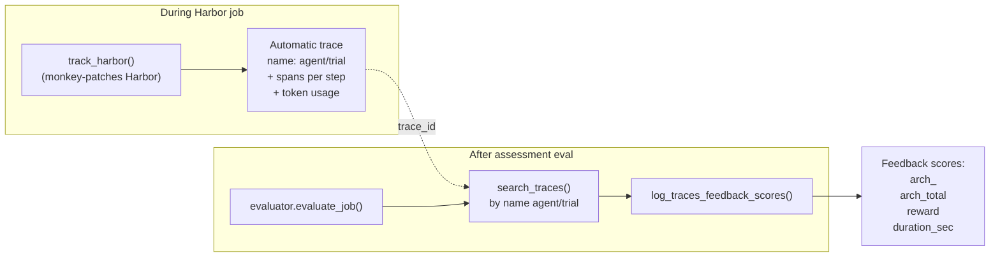
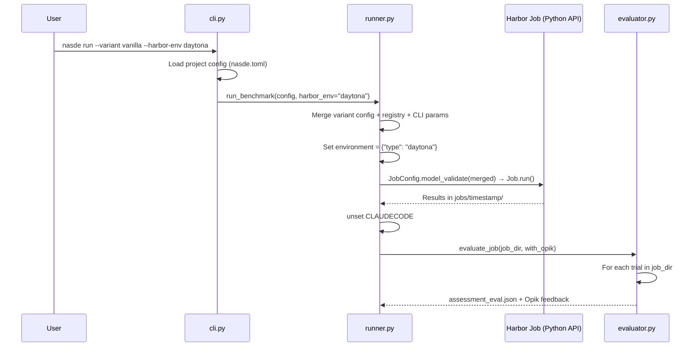

# NASDE Toolkit Architecture

## Overview

NASDE evaluates AI coding agents (e.g. Claude Code, OpenAI Codex, Gemini CLI) on programming tasks. It uses **Harbor** as the execution engine running agents in isolated sandbox environments and **Opik** as the observability platform for tracking results.

Key design: evaluation is **two-stage** — Harbor assesses functional correctness (tests pass/fail), then a separate reviewer agent (the `claude` or `codex` CLI, spawned as a subprocess) assesses architectural quality of the generated code.

---

## End-to-end flow



---

## What happens inside Harbor

Harbor is a framework for evaluating AI agents. You provide an agent, a dataset, and run a job. NASDE adds minimal but important customizations on top.

### Trial lifecycle



### Inside the sandbox



Harbor only measures **functional correctness** — tests pass or fail, yielding a binary reward. Whether the agent wrote the code *well* is not something Harbor measures. That's where assessment evaluation comes in.

### Docker environment auto-generation

When a task has no `environment/Dockerfile`, the runner calls `docker.py:ensure_task_environment()` to auto-generate one from `source.git` + `[docker]` config. For local paths (not starting with `http`/`https`/`git`/`file`), it also generates `environment/docker-compose.yaml` with a `build.context` override pointing to the repo root, so Harbor's `DockerEnvironment` uses the correct build context for `COPY`-based Dockerfiles.

---

## Cloud sandbox providers

Harbor supports multiple execution environments. The provider is set at the **job level** — all trials in a job use the same environment.

| Provider | `--harbor-env` value | Use case |
|----------|---------------------|----------|
| Docker | `docker` (default) | Local development, small runs |
| Daytona | `daytona` | Horizontal scaling, recommended for production |
| Modal | `modal` | Serverless execution |
| E2B | `e2b` | Sandboxed environments |
| Runloop | `runloop` | Runloop platform |
| GKE | `gke` | Google Kubernetes Engine |

### How it works

NASDE passes the environment choice to Harbor's `JobConfig`:

```python
# In runner.py _build_merged_config()
if harbor_env:
    merged["environment"] = {"type": harbor_env}
```

Harbor's `EnvironmentFactory` creates the appropriate environment class based on `EnvironmentConfig.type`. All environments implement the same `BaseEnvironment` interface (`start`, `stop`, `upload_file`, `download_file`, `exec`), so agent code works identically regardless of the provider.

### What runs where

| Component | Where it runs |
|-----------|--------------|
| Harbor trial (agent + test.sh) | Sandbox (Docker or cloud) |
| Assessment evaluation (reviewer agent) | Host machine (always local) |
| Opik tracing | Host machine (API calls to Opik cloud) |

The assessment evaluator reads artifacts that Harbor already copied from the sandbox to `jobs/<ts>/<trial>/artifacts/workspace/` on the host filesystem. It does not need access to the sandbox.

---

## Assessment evaluation — LLM-as-a-Judge

This is NASDE's key extension beyond default Harbor. It runs **entirely on the host machine**, outside of Harbor. After Harbor finishes all trials and sandboxes are torn down, NASDE invokes `evaluator.evaluate_job()` as a separate step.



---

## Evaluator configuration

The evaluator agent is configurable via `[evaluation]` in `nasde.toml`. All options are optional — defaults provide a working evaluator out of the box.

| Setting | Default | Purpose |
|---------|---------|---------|
| `backend` | `claude` | Subprocess backend: `claude` (`ClaudeSubprocessBackend`) or `codex` (`CodexSubprocessBackend`) |
| `model` | `claude-opus-4-7` | Evaluator model (Opus recommended for review quality) |
| `dimensions_file` | `assessment_dimensions.json` | Path to scoring dimensions |
| `max_turns` | `30` | Max conversation turns for evaluator |
| `allowed_tools` | `["Read", "Glob", "Grep"]` | Tool whitelist for evaluator |
| `mcp_config` | — | Path to MCP server config JSON (same format as Claude Code MCP config) |
| `skills_dir` | — | Path to skills directory (copied into evaluator's `.claude/skills/`) |
| `append_system_prompt` | — | Extra text appended to evaluator's system prompt |
| `include_trajectory` | `false` | Include ATIF trajectory data in evaluation (opt-in) |

Backends are pluggable via the `EvaluatorBackend` Protocol in `src/nasde_toolkit/evaluator_backends/protocol.py`. Both current backends spawn a CLI subprocess — not a Python SDK call — so the evaluator inherits the user's existing CLI authentication (OAuth subscription or API key). This avoids Anthropic's SDK-billing restrictions on subscription accounts: running `claude -p` under your shell is billed the same as interactive use.

- `ClaudeSubprocessBackend` invokes `claude -p --output-format json --model <model> --allowed-tools ... [--append-system-prompt ...] [--mcp-config ...] [--add-dir ...]`. The `--bare` flag is deliberately omitted so the CLI reads OAuth tokens from the keychain and auto-discovers skills.
- `CodexSubprocessBackend` invokes `codex exec --json --quiet --full-auto --model <model> [--sandbox ...]` and parses the JSONL event stream emitted to stdout.

When `include_trajectory` is set to `true`, the evaluator prompt includes a reference to the agent's ATIF trajectory file (`agent/trajectory.json`), and the trial directory is added to the backend's `--add-dir` set so the evaluator can read it. This enables assessment dimensions that evaluate the agent's process (tool usage, efficiency, decision-making) alongside the final output. The trajectory file is not preprocessed — the evaluator reads it directly via the Read tool.

When `skills_dir` is set, the `ClaudeSubprocessBackend` stages a temp-dir workspace with the skills copied under `.claude/skills/`, runs `claude` with `cwd` pointing there, and passes the artifact path via `--add-dir` so Claude's native skill auto-discovery picks up the skills.

When `mcp_config` is set, its path is passed through to the backend CLI (`--mcp-config` for Claude). MCP tool names follow the `mcp__<server>__<tool>` convention and must be included in `allowed_tools` if that field is overridden.

---

## Custom agent classes



Harbor natively handles auth, MCP servers, model selection, and timeout for all agents. `ConfigurableClaude`, `ConfigurableCodex`, and `ConfigurableGemini` each add **one thing**: declarative file mapping from host to the sandbox via `sandbox_files` in `harbor_config.json`. `ConfigurableGemini` additionally handles OAuth credential injection and DNS resolution for cloud sandboxes. The agent type is auto-detected from the variant's instruction file (`CLAUDE.md` → Claude, `AGENTS.md` → Codex, `GEMINI.md` → Gemini).

---

## Agent variants

Each benchmark defines its **own set of variants** — there are no globally shared variants. A variant represents a specific agent configuration to be compared against other variants on the same set of tasks.

Each variant is a directory under `variants/<variant-name>/` containing:
- `variant.toml` — **required**, declares the agent type (`agent = "claude"`, `agent = "codex"`, or `agent = "gemini"`)
- `CLAUDE.md` — Claude Code instructions injected into `/app/CLAUDE.md` (for Claude variants)
- `AGENTS.md` — Codex instructions injected into `/app/AGENTS.md` (for Codex variants)
- `GEMINI.md` — Gemini CLI instructions injected into `/app/GEMINI.md` (for Gemini variants)
- `skills/` — Claude skill snapshots, each `skills/<name>/SKILL.md` injected into `/app/.claude/skills/<name>/SKILL.md` (optional)
- `agents_skills/` — Codex skill snapshots, each `agents_skills/<name>/` injected recursively into `/app/.agents/skills/<name>/` (optional)
- `gemini_skills/` — Gemini skill snapshots, each `gemini_skills/<name>/` injected recursively into `/app/.gemini/skills/<name>/` and `~/.gemini/skills/<name>/` (optional)
- `harbor_config.json` — agent import path + `sandbox_files` mapping (auto-generated from `variant.toml` if absent)
- `claude_config.json` — MCP server configuration, Claude only (optional)

Variants can differ along many axes: agent type, instruction specificity, skill combinations, tool access, constraints, prompting techniques. Cross-agent comparison (e.g. Claude vs Codex vs Gemini on the same tasks) is a key use case.

---

## Opik integration



Two integration points:
1. **`track_harbor()`** — Opik's monkey-patch over Harbor. Automatically creates traces with agent steps, token usage, and duration
2. **`evaluate_job() --with-opik`** — finds the existing trace by name `agent_name/trial_name`, attaches feedback scores

---

## Orchestration — `nasde run`



The runner builds a **merged config** by combining:
- `variants/<name>/harbor_config.json` — agent definition (import path, sandbox_files)
- Task registry — discovered from `tasks/` directory
- CLI parameters — model, timeout, harbor_env, task filter

---

## Trial result structure

```
jobs/2026-03-12__14-30-00/
└── sample-task__vanilla__0/
    ├── result.json              # reward, duration, task_id, source
    ├── config.json              # Agent config used for this trial
    ├── assessment_eval.json     # LLM-as-a-Judge evaluation result
    ├── agent/
    │   └── trajectory.json      # ATIF: agent steps, tool calls, tokens
    └── artifacts/
        └── workspace/           # Modified files from /app/
```

---

## Package structure

```
src/nasde_toolkit/
  cli.py                   # Typer CLI (init, run, eval + harbor/opik pass-through)
  config.py                # nasde.toml + task.toml parsing into dataclasses
  runner.py                # Harbor Python API — variant resolution, config merging, Job execution
  evaluator.py             # Post-hoc assessment — builds the prompt, delegates to a pluggable subprocess backend
  evaluator_backends/
    protocol.py            # EvaluatorBackend Protocol + factory
    claude_subprocess.py   # `claude -p --output-format json` backend (default)
    codex_subprocess.py    # `codex exec --json --quiet --full-auto` backend
  docker.py                # Docker environment helpers
  scaffold/                # Project scaffolding templates
  agents/
    configurable_claude.py # Harbor-compatible Claude Code agent with sandbox file injection
    configurable_codex.py  # Harbor-compatible Codex agent with sandbox file injection
    configurable_gemini.py # Harbor-compatible Gemini CLI agent with sandbox file injection + OAuth
```
