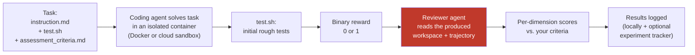

<div align="center">
  <a href="https://noesis.vision/nasde/"></a>

  <h3>Noesis Agentic Software Development Evals Toolkit</h3>

  <p>Run an AI coding agent on a task you already know the answer to. Score the result. Compare configurations.</p>

  <a href="https://noesis.vision/nasde/"></a>
  <a href="https://discord.gg/QF5PMX4Dqg"></a>
  <br>
  <a href="https://github.com/NoesisVision/nasde-toolkit/actions/workflows/quality-gate.yml"></a>
  <a href="LICENSE"></a>
</div>

---

## What NASDE does — in four steps

One `nasde run` command executes the whole chain.

1. **You describe a task you already understand.** An instruction, a repo snapshot, and the assessment criteria describing what a good solution looks like. The output can be anything the agent writes into its workspace — code, a migration plan, an ADR, a SQL script, updated docs.
2. **The agent solves it in a sandbox.** The agent works in a safe, isolated environment — it can't touch your machine or your real code. Every run starts from the same clean state, so different configurations get a fair comparison. When it's done, a quick `test.sh` check gives a rough pass/fail signal. Powered by [Harbor](https://github.com/cased/harbor), runs locally on Docker or in the cloud.
3. **A reviewer agent assesses the result against your criteria.** After initial rough tests pass or fail, a second coding agent (`claude` or `codex`) navigates the workspace and scores your chosen dimensions (e.g. *domain modeling*, *test quality*) on whatever scale you picked. The review stays token-efficient even on large codebases.
4. **Results land in a dashboard (optional).** Browse scores, compare variants, and track how your agent setup evolves over time — optionally via [Opik](https://www.comet.com/site/products/opik/).

You're the one defining "what good looks like." NASDE just automates running the experiment and assessing it the same way every time.

## What do I use it for?

Anyone working with AI coding agents eventually hits the same wall: *"I changed my skill / `CLAUDE.md` / MCP setup — is the agent actually better now, or does it just feel that way?"* NASDE turns that gut feeling into a repeatable measurement.

Typical things you'd do with it:

- **Run an agent safely on a realistic task** — a sandboxed container means the agent can `rm -rf`, install random packages, or run your tests in loops without wrecking your laptop.
- **Compare two configurations of the same agent** — baseline vs. "with my new skill"; see whether the skill moves the score up or down, and on which dimensions.
- **Compare different agents on the same task** — Claude Code vs. Codex vs. Gemini CLI against *your* workspace and *your* criteria.
- **Build a regression suite for your AI setup** — once a task set exists, re-run it every time someone tweaks the prompt/skills/MCP and spot regressions before they ship.

## Quick start (three steps)

The fastest path from zero to a working benchmark built from **your own git history**:

### 1. Install the CLI

```bash
uv tool install git+https://github.com/NoesisVision/nasde-toolkit.git@v0.2.0
nasde --version
```

### 2. Install the authoring skills for Claude Code

```bash
nasde install-skills
```

This copies the bundled `nasde-benchmark-*` skills into `~/.claude/skills/` so they're available in every Claude Code session. Use `--scope project` to install into the current project's `.claude/skills/` instead, or `--force` to overwrite after a `nasde` upgrade.

> **Note:** the authoring helpers are Claude Code skills. Codex and Gemini users can still run NASDE from the CLI — the skills just speed up *creating* benchmarks; they are not required to *run* them.

### 3. From inside your own repo, ask the agent to build a benchmark from git history

Open your own project in Claude Code and say something like:

> *"Create a NASDE benchmark with a single task, based on a recent piece of work from this repo — a commit, a range of commits, or a merged PR."*

Start with **one task**. Point the skill at whatever unit of work feels self-contained in your workflow — a single commit, a range, a merged MR/PR, or an issue that was closed by a set of commits. The `nasde-benchmark-from-history` skill proposes a good candidate, and generates one task directory with `instruction.md`, a Dockerfile, `test.sh`, and a starter `assessment_criteria.md`. You review each file before it's written.

Then run it:

```bash
nasde run --all-variants -C path/to/generated-benchmark
```

`--all-variants` runs every variant the skill scaffolded, so you don't need to know their names yet. If you'd rather burn fewer tokens on the first run, pick just one with `--variant NAME` — you can run the others later.

### Good to know

- **Start small.** One task is enough to validate the loop end to end. Scale up once it works — more tasks only pay off after you've seen what a task looks like in practice.
- **Your subscription covers it.** Runs use your existing `claude` / `codex` / `gemini` CLI auth, so a Claude Max or ChatGPT Plus subscription is enough to get going. API keys are supported too when you have them — see [Authentication](#authentication) for the full picture.
- **More docs.** See [Use Cases](docs/use-cases.md) for the end-to-end walkthrough and [Benchmark Results](docs/benchmark-results.md) for reference numbers.

## How does the scoring actually work?

This is the question that trips most people up, so it's worth being explicit. There are **two independent kinds of scoring** in NASDE, and they answer different questions:

### 1. Initial rough tests — deterministic pass/fail (reward 0 or 1)

This is the standard verifier pattern used by [Harbor](https://github.com/cased/harbor) and other coding-agent benchmarks — every task has a `tests/test.sh` script. After the agent finishes, the script runs inside the container and either passes (reward = 1) or fails (reward = 0). There's nothing AI about this step — it's just a shell script. What "passing" means is entirely up to you:

- For a bug-fix task: *"the regression test that was failing now passes"*
- For a refactor: *"the existing test suite still passes — no behavior change"*
- For a feature: *"the new integration test I wrote passes"*

This gives you a hard yes/no on correctness. It says nothing about *how* the result got there or whether its structure is any good.

### 2. Multi-dimensional assessment — scored by a reviewer agent (LLM-as-a-Judge)

These rough tests only catch black-and-white failures. They don't tell you whether the produced workspace is well-structured, whether it respects your architecture, whether tests are meaningful (or just coverage padding), whether a generated document is clear, whether a migration is reversible. For that, NASDE runs a **second agent** — the reviewer — on the produced workspace.

The reviewer's reference point is **two files you write** when creating the benchmark:

| File | What goes in it | Who writes it |
|---|---|---|
| `assessment_dimensions.json` | The list of dimensions to score on (e.g. *Domain Modeling*, *Test Quality*, *Documentation Clarity*), plus a max score per dimension | You — once, shared across all tasks in the benchmark |
| `assessment_criteria.md` | Per-task criteria: for each dimension, what a low score looks like, what a high score looks like, what specific things to check | You — once per task, in plain prose |

The reviewer agent reads the produced results (and optionally the agent's tool-call trajectory), then scores each dimension against your criteria. You decide how strict the criteria are — spell out a ground-truth structure, enumerate exact checks, or leave room for judgment. Whatever gives you a signal you trust.

**The reviewer is itself a coding agent** (`claude` or `codex` CLI). Instead of stuffing the whole workspace into a prompt, it navigates with real tools — `Read`, `Glob`, `Grep`, and optionally MCP analysis servers — reading only what each dimension actually needs. That's why reviews stay tractable on large workspaces.

## The evaluation pipeline, end to end



Stage 1 (the agent does the work in a sandbox) comes from [Harbor](https://github.com/cased/harbor). The optional experiment-tracking stage at the end uses [Opik](https://github.com/comet-ml/opik). NASDE is the glue that connects them and adds the reviewer stage in between — plus the CLI, the benchmark project layout, and the authoring skills (see below).

## What a real task looks like

Everything above is easier to grasp on a concrete example. Here is one benchmark task from the repo — [`examples/ddd-architectural-challenges/tasks/ddd-weather-discount`](https://github.com/NoesisVision/nasde-toolkit/tree/main/examples/ddd-architectural-challenges/tasks/ddd-weather-discount) — shown end to end: the agent's instruction, the assessment criteria, and the resulting scores.

### `instruction.md` — what the coding agent is asked to do

> **Task — Implement a weather-based discount.**
>
> You are working on an e-commerce system built using **Domain-Driven Design** and **hexagonal architecture** (.NET 8, C#). Implement a discount that:
>
> - Checks current weather in Warsaw via the Open-Meteo API.
> - Applies a **10% discount** when `precipitation > 0`.
> - Must be **extensible**: more weather-based discounts (temperature, wind, UV, humidity) will follow and should plug in without rewrites.
>
> **Quality expectations:** fit into the existing DDD architecture · handle API failures gracefully (do not break order processing) · write unit and integration tests · follow codebase conventions.

### `assessment_criteria.md` — what the reviewer scores against (excerpt)

The criteria spell out what each score means for each dimension. Here is the full ladder for the *Domain Modeling* dimension — in this benchmark the author chose a 0–25 scale (the scale is entirely up to you: 0–5, 0–10, 0–100, named levels, pass/fail only, whatever fits):

| Score | Criteria |
|:---:|---|
| **0**  | No domain types for weather — raw HTTP responses or primitives used directly in domain logic. |
| **10** | Domain types exist for weather, but they leak infrastructure concerns (JSON annotations, HTTP status codes). |
| **15** | Clean domain types (precipitation as a value object), but discount logic is *not* modeled as a domain service or policy. |
| **20** | Good domain modeling and discount as a domain service, but error handling uses infrastructure exceptions instead of domain-appropriate patterns. |
| **25** | Weather modeled as value objects · discount encapsulated in a domain service/policy · failures handled via domain patterns (Result type, domain exceptions, safe defaults) · domain layer has **zero** infrastructure dependencies. |

**Key checks for the reviewer agent:**

- Is there a port / interface for weather data in the *domain* layer?
- Does that port use domain types (not `HttpResponseMessage`, `JsonElement`)?
- Is the discount rule inside a domain service / policy, or living in the HTTP adapter?
- Are failure modes (API down) handled with domain-appropriate defaults?

> The full assessment covers four more dimensions the benchmark author picked for this task (*Encapsulation* · *Architecture Compliance* · *Extensibility* · *Test Quality*), each with its own ladder and checks. Another author would have chosen different dimensions or different scales for the same task.

### Results — four agent configurations scored against the same criteria

| Variant | Pass | Domain (/25) | Encaps. (/20) | Arch. (/20) | Ext. (/15) | Tests (/20) | Total (/100) |
|---|:---:|:---:|:---:|:---:|:---:|:---:|:---:|
| `claude-vanilla` | 75% | 17.1 | 11.2 | 16.1 | 9.5 | 7.7 | **61.6** |
| `claude-guided` (with a DDD skill) | 75% | 17.4 | 12.4 | 16.6 | 10.0 | 8.7 | **65.1** |
| `codex-vanilla` | 89% | 18.8 | 13.8 | 16.8 | 11.4 | 8.7 | **69.4** |
| `codex-guided` (same skill) | 50% | 11.5 | 9.6 | 12.9 | 7.4 | 6.0 | **47.4** |

**The insight:** the same "DDD guidance" skill helps Claude a little (+3.5) and *badly* hurts Codex (-22). The per-dimension breakdown pinpoints *where* Codex regresses — domain modeling, encapsulation, extensibility — which would be invisible without this assessment. Skill optimization is agent-specific.

### More benchmarks in the repo

- **Refactoring katas (Java + Python)** — four classic refactorings scored on behavior preservation, clarity, technique, scope discipline. *Takeaway:* a candidate "refactoring skill" didn't move the score — shipping it would have been based on vibes.
- **Project-specific skill validation (NASDE's own repo)** — one task pulled from NASDE's git history; four skill combinations tested. *Takeaway:* the testing-discipline skill alone raised pass rate from 67% → 100%; the "full-stack, everything-on" variant scored *worse* than vanilla.

See **[Benchmark Results](docs/benchmark-results.md)** for the full tables and methodology, and **[Use Cases](docs/use-cases.md)** for the end-to-end walkthrough of building a benchmark like these yourself.

## Authoring helpers (Claude Code skills)

Writing `assessment_criteria.md`, picking tasks from git history, and scaffolding Dockerfiles is the tedious part of building a benchmark. NASDE ships [Claude Code skills](https://docs.anthropic.com/en/docs/claude-code/skills) that take care of most of it — install them with one command:

```bash
nasde install-skills                  # → ~/.claude/skills/ (user-wide)
nasde install-skills --scope project  # → ./.claude/skills/ (current repo)
nasde install-skills --force          # overwrite after upgrading nasde
```

After installation, the skills activate automatically in any Claude Code session — just describe what you want.

| Skill | What it does |
|-------|-------------|
| **nasde-benchmark-creator** | Interactive end-to-end scaffolding: project layout, tasks, Dockerfiles, test scripts, assessment criteria. |
| **nasde-benchmark-from-history** | Point it at a commit range, a merged PR, or a closed issue from your own repo — it proposes tasks based on work your team already finished, and writes the task files for you to review. |
| **nasde-benchmark-from-public-repos** | Describe a skill you want to test broadly; it builds a diversity matrix of public repos (languages, sizes, styles) and scaffolds one task per cell. |
| **nasde-benchmark-runner** | Guides running benchmarks, re-running the reviewer on existing results, verifying the experiment tracker, and troubleshooting failed runs. |

You don't *have* to use these — everything they do is just writing files that you could write by hand — but they save a lot of typing.

## Installation reference

The [Quick start](#quick-start-three-steps) above pins to the latest stable release. Alternative installation modes:

```bash
# Install the latest development build from main (may include unreleased changes)
uv tool install git+https://github.com/NoesisVision/nasde-toolkit.git

# Install from a local clone (for developing NASDE itself)
git clone git@github.com:NoesisVision/nasde-toolkit.git
cd nasde-toolkit
uv sync
```

Upgrading to a new stable release:

```bash
uv tool install --reinstall git+https://github.com/NoesisVision/nasde-toolkit.git@v0.2.0
```

After installation, only `nasde` appears on PATH. Harbor and Opik are bundled as core dependencies. The reviewer agent spawns your already-installed `claude` or `codex` CLI as a subprocess (not bundled), so it reuses whatever authentication you've set up interactively.

Check the installed version with `nasde --version`. Stable releases follow semver tags (e.g. `v0.2.0`); dev installs show versions like `0.2.1.dev3+gabcdef`.

## CLI cheatsheet

Most users only need `nasde run` — everything else is occasional. See [Commands](#commands) below for the full reference.

```bash
# Scaffold a new benchmark project from scratch
nasde init my-benchmark

# Run the default variant
nasde run --variant vanilla -C my-benchmark

# Codex variant (model name is OpenAI-side)
nasde run --variant codex-baseline --model gpt-5.3-codex -C my-benchmark

# Gemini CLI variant
nasde run --variant gemini-baseline --model google/gemini-3-flash-preview -C my-benchmark

# Run a single task with experiment tracking
nasde run --variant vanilla --tasks my-task -C my-benchmark --with-opik

# Skip the reviewer (rough tests only, faster)
nasde run --variant vanilla -C my-benchmark --without-eval

# Re-run the reviewer on an existing trial (no re-execution)
nasde eval jobs/2026-03-13__14-30-00 --with-opik -C my-benchmark
```

Authentication is covered in detail in the [Authentication](#authentication) section — in short, export an API key (`ANTHROPIC_API_KEY` / `CODEX_API_KEY` / `GEMINI_API_KEY`) **or** just use whatever OAuth subscription you're already logged into via `claude` / `codex` / `gemini login`.

## Cloud sandbox providers

By default, Harbor runs agents in **local Docker containers**. For horizontal scaling, you can use a cloud sandbox provider — this shifts command execution to the cloud, making trials I/O bounded rather than compute bounded. You can typically parallelize far above your local CPU count.

Supported providers (via Harbor):

| Provider | Flag value | API key env var |
|----------|-----------|-----------------|
| Docker (default) | `docker` | — |
| [Daytona](https://www.daytona.io/) | `daytona` | `DAYTONA_API_KEY` |
| [Modal](https://modal.com/) | `modal` | `MODAL_TOKEN_ID` + `MODAL_TOKEN_SECRET` |
| [E2B](https://e2b.dev/) | `e2b` | `E2B_API_KEY` |
| [Runloop](https://www.runloop.ai/) | `runloop` | `RUNLOOP_API_KEY` |
| [GKE](https://cloud.google.com/kubernetes-engine) | `gke` | GCP credentials |

We recommend **Daytona** for its flexibility and scaling capabilities.

```bash
# Run with Daytona cloud sandbox
export DAYTONA_API_KEY=...
nasde run --variant vanilla --harbor-env daytona -C my-benchmark

# Or use the Harbor pass-through for full control
nasde harbor run --dataset my-benchmark@1.0 --agent claude-code --model claude-sonnet-4-6 --env daytona -n 32
```

The cloud sandbox provider affects **only the Harbor trial execution** (Stage 1). The assessment evaluation (Stage 2) always runs locally on the host machine.

You can set a default provider in `nasde.toml`:

```toml
[defaults]
harbor_env = "daytona"
```

See the [Harbor documentation](https://harborframework.com/docs/cloud) for detailed provider configuration.

## Configuring the reviewer agent

The reviewer agent (assessment evaluator) is configurable via the `[evaluation]` section in `nasde.toml`. By default it uses `claude-opus-4-7` with read-only tools (`Read`, `Glob`, `Grep`).

### Evaluator backend

By default, nasde uses Claude Code CLI for assessment evaluation. You can switch to Codex:

```toml
[evaluation]
backend = "codex"      # "claude" (default) | "codex"
model = "gpt-5.3-codex"
```

Supported backends:
- `claude` (default) — requires `claude` CLI installed and authenticated
- `codex` — requires `codex` CLI installed and authenticated

Both backends use your existing CLI authentication (subscription OAuth or API key) — no additional setup required. The evaluator spawns the CLI as a subprocess, so you get the same billing treatment as interactive use.

See [`examples/nasde-dev-skill/nasde.codex.toml`](examples/nasde-dev-skill/nasde.codex.toml) for a ready-to-use Codex configuration — swap it in with:

```bash
cp examples/nasde-dev-skill/nasde.codex.toml examples/nasde-dev-skill/nasde.toml
```

### Model

Use the best available model for review quality:

```toml
[evaluation]
model = "claude-opus-4-7"   # Default — recommended for review quality
```

### Skills

Give the reviewer agent skills (e.g. a code review methodology). Create a directory with `SKILL.md` files:

```
my-benchmark/
  evaluator_skills/
    code-review/
      SKILL.md              # Review methodology, scoring principles
```

```toml
[evaluation]
skills_dir = "./evaluator_skills"
```

Skills are copied into the evaluator's workspace and loaded via the CLI's native auto-discovery (`claude --add-dir <workspace>`). The evaluator's prompt automatically adjusts to reference artifact paths correctly.

### MCP servers

Add external analysis tools (linters, complexity analyzers) as MCP servers:

```json
// evaluator_mcp.json
{
  "mcpServers": {
    "code-analysis": {
      "type": "stdio",
      "command": "npx",
      "args": ["@some-org/code-analysis-mcp"]
    }
  }
}
```

```toml
[evaluation]
mcp_config = "./evaluator_mcp.json"
allowed_tools = ["Read", "Glob", "Grep", "mcp__code-analysis__analyze"]
```

MCP tool names follow the `mcp__<server>__<tool>` convention. If you override `allowed_tools`, you must include the MCP tools explicitly.

### System prompt

Append custom instructions to the evaluator's system prompt:

```toml
[evaluation]
append_system_prompt = "Pay special attention to SOLID principles when scoring."
```

### All options

| Setting | Default | Purpose |
|---------|---------|---------|
| `backend` | `claude` | Subprocess backend: `claude` or `codex` |
| `model` | `claude-opus-4-7` | Evaluator model |
| `dimensions_file` | `assessment_dimensions.json` | Scoring dimensions file |
| `max_turns` | `30` | Max conversation turns |
| `allowed_tools` | `["Read", "Glob", "Grep"]` | Tool whitelist |
| `mcp_config` | — | Path to MCP server config JSON |
| `skills_dir` | — | Path to evaluator skills directory |
| `append_system_prompt` | — | Extra system prompt text |
| `include_trajectory` | `false` | Include ATIF trajectory in evaluation |

When `include_trajectory` is enabled, the evaluator can read the agent's full execution trajectory (`agent/trajectory.json`) — tool calls, timestamps, token usage, errors. This enables assessment dimensions that evaluate the agent's *process* (efficiency, verification discipline, decision-making) alongside the final output. See [`examples/nasde-dev-skill`](examples/nasde-dev-skill) for a working example with trajectory-aware dimensions.

## Local repo benchmarks

You can build benchmarks from local (private) repositories by setting `source.git` to a relative path:

```json
{
  "source": {
    "git": "../..",
    "ref": "abc1234"
  }
}
```

nasde auto-generates the Docker environment — no custom `Dockerfile` needed. See `examples/nasde-dev-skill/` for a complete example that tests nasde-toolkit itself.

## Commands

### Core

| Command | Description |
|---------|-------------|
| `nasde run` | Run benchmark: Harbor trial + assessment evaluation (default) |
| `nasde eval <JOB_DIR>` | Re-run assessment evaluation on an existing job |
| `nasde init [DIR]` | Scaffold a new evaluation project |
| `nasde install-skills` | Install bundled Claude Code authoring skills into `~/.claude/skills/` (or `./.claude/skills/` with `--scope project`) |

### Pass-through

| Command | Description |
|---------|-------------|
| `nasde harbor ...` | Full Harbor CLI (view, jobs resume, trials, datasets, etc.) |
| `nasde opik ...` | Opik CLI (configure, usage-report, export, etc.) |

### `nasde run` options

| Flag | Description |
|------|-------------|
| `--variant` | Variant to run (defaults to config default) |
| `--tasks` | Comma-separated task names to run |
| `--model` | Model override (e.g. `claude-sonnet-4-6`, `o3`, `google/gemini-3-flash-preview`) |
| `--timeout` | Agent timeout in seconds |
| `--with-opik` | Enable Opik tracing |
| `--without-eval` | Skip assessment evaluation |
| `--harbor-env` | Harbor execution environment (`docker`, `daytona`, `modal`, `e2b`, `runloop`, `gke`) |
| `--project-dir`, `-C` | Path to evaluation project |

## Project structure

A scaffolded project has the following layout:

```
my-benchmark/
  nasde.toml                  # Project configuration
  assessment_dimensions.json   # Scoring dimensions (shared across tasks)
  tasks/
    feature-a/
      task.json                # Task source + evaluation config
      instruction.md           # Agent prompt
      assessment_criteria.md   # Per-task criteria for post-hoc evaluator
      tests/
        test.sh                # Harbor verification script
  variants/
    vanilla/                   # Claude Code variant
      variant.toml             # agent = "claude"
      CLAUDE.md                # Agent system prompt (injected to /app/CLAUDE.md)
    guided/                    # Claude Code variant with skills
      variant.toml             # agent = "claude"
      CLAUDE.md
      skills/                  # Claude skills (injected to /app/.claude/skills/)
        my-skill/
          SKILL.md
    codex-baseline/            # Codex variant
      variant.toml             # agent = "codex"
      AGENTS.md                # Codex instructions (injected to /app/AGENTS.md)
    codex-with-skills/         # Codex variant with skills
      variant.toml             # agent = "codex"
      AGENTS.md
      agents_skills/           # Codex skills (injected to /app/.agents/skills/)
        my-skill/
          SKILL.md             # Requires YAML frontmatter (name + description)
    gemini-baseline/           # Gemini CLI variant
      variant.toml             # agent = "gemini"
      GEMINI.md                # Gemini instructions (injected to /app/GEMINI.md)
    gemini-with-skills/        # Gemini CLI variant with skills
      variant.toml             # agent = "gemini"
      GEMINI.md
      gemini_skills/           # Gemini skills (injected to /app/.gemini/skills/)
        my-skill/
          SKILL.md
  evaluator_skills/            # Optional: skills for the evaluator agent
    code-review/
      SKILL.md
  evaluator_mcp.json           # Optional: MCP server config for evaluator
  jobs/                        # Trial output (gitignored)
```

Each variant must have a `variant.toml` declaring the agent type:

```toml
agent = "claude"   # or "codex" or "gemini"
```

### `nasde.toml`

```toml
[project]
name = "my-benchmark"
version = "1.0.0"

[defaults]
variant = "vanilla"
model = "claude-sonnet-4-6"
timeout_sec = 720
# harbor_env = "daytona"  # Optional: cloud sandbox provider

[docker]
base_image = "ubuntu:22.04"
build_commands = []

[evaluation]
backend = "claude"                            # "claude" (default) | "codex"
model = "claude-opus-4-7"
dimensions_file = "assessment_dimensions.json"
# max_turns = 30                              # Max evaluator conversation turns
# allowed_tools = ["Read", "Glob", "Grep"]    # Override default tool whitelist
# mcp_config = "./evaluator_mcp.json"         # MCP server config for evaluator
# skills_dir = "./evaluator_skills"           # Skills directory for evaluator
# append_system_prompt = ""                   # Extra system prompt for evaluator
# include_trajectory = false                   # Include ATIF trajectory in evaluation

[reporting]
platform = "opik"
```

## Architecture

See [ARCHITECTURE.md](ARCHITECTURE.md) for the full system architecture with diagrams, and [docs/adr/](docs/adr/) for architectural decision records.

Key design: `nasde` is a **thin integration layer** over Harbor and Opik, not a replacement. Core flow uses their Python APIs directly; utility commands pass through to their CLIs unchanged. The underlying tools can be swapped in the future without changing the evaluation workflow.

## Authentication

NASDE auto-detects the required credentials based on the variant's agent type.

### Claude Code

The tool checks for auth tokens in this order:
1. `ANTHROPIC_API_KEY` environment variable
2. `CLAUDE_CODE_OAUTH_TOKEN` environment variable

On macOS, you can extract the OAuth token from your Claude Code keychain entry (created when you log in via `claude` CLI):

```bash
source scripts/export_oauth_token.sh
# ✓ CLAUDE_CODE_OAUTH_TOKEN exported (sk-ant-oat01-...)
```

This lets you use your Claude Pro/Max subscription instead of an API key.

### OpenAI Codex

Codex variants support two authentication methods:

**Option 1: ChatGPT subscription (OAuth)** — uses your ChatGPT Plus/Pro/Business plan credits, not API billing.

```bash
codex login                                # authenticate via ChatGPT (one-time)
source scripts/export_codex_oauth_token.sh # validate tokens are present
uv run nasde run --variant codex-vanilla -C my-benchmark
```

NASDE auto-detects `~/.codex/auth.json` with `auth_mode: "chatgpt"` and injects the full OAuth token structure into the sandbox. No env vars needed.

**Option 2: API key** — billed per-token through your OpenAI Platform account.

```bash
export CODEX_API_KEY=sk-...  # preferred
# or: export OPENAI_API_KEY=sk-...
```

API key always takes priority over OAuth when both are present.

### Gemini CLI

Gemini CLI variants support three authentication methods:

**Option 1: API key (Google AI Studio)** — billed per-token through your Google AI Studio account.

```bash
export GEMINI_API_KEY=your-key
```

**Option 2: Google Cloud / Vertex AI** — uses your Google Cloud project billing.

```bash
export GOOGLE_API_KEY=your-key
export GOOGLE_CLOUD_PROJECT=your-project
```

**Option 3: OAuth (Google account)** — uses your Gemini subscription credits.

```bash
gemini login                                  # authenticate via Google account (one-time)
source scripts/export_gemini_oauth_token.sh   # validate tokens are present
uv run nasde run --variant gemini-baseline -C my-benchmark
```

NASDE auto-detects `~/.gemini/oauth_creds.json` and injects the credentials into the sandbox. No env vars needed.

API key env vars (`GEMINI_API_KEY`, `GOOGLE_API_KEY`, `GOOGLE_APPLICATION_CREDENTIALS`) always take priority over OAuth when present.

### Opik tracing

For Opik tracing, set credentials in `.env` (in project dir or parent):
```
OPIK_API_KEY=...
OPIK_WORKSPACE=...
```

The Opik project name is automatically set to the benchmark name (from `nasde.toml [project] name`).

## Prerequisites

- **Python 3.12+**
- **Docker** (default) or a cloud sandbox provider — Harbor runs agents in isolated environments
- **uv** — Package manager
- **npm** — Required for Gemini CLI (`@google/gemini-cli` is installed automatically by Harbor)
- **Agent credentials** (at least one):
  - Claude Code: `ANTHROPIC_API_KEY` or `CLAUDE_CODE_OAUTH_TOKEN`
  - OpenAI Codex: `CODEX_API_KEY` (API key) or `codex login` (ChatGPT subscription OAuth)
  - Gemini CLI: `GEMINI_API_KEY` (API key), `GOOGLE_API_KEY` (Vertex AI), or `gemini login` (Google account OAuth)
- **Evaluator CLI** — the assessment evaluator spawns the `claude` CLI by default (or `codex` if `[evaluation] backend = "codex"`). That CLI must be installed and authenticated (OAuth subscription or API key — whichever you already use interactively)

## Verifying Opik results

```python
import urllib.request, json

req = urllib.request.Request(
    "https://www.comet.com/opik/api/v1/private/traces?project_name=<PROJECT>&limit=1",
    headers={
        "authorization": "<OPIK_API_KEY>",
        "Comet-Workspace": "<WORKSPACE>",
    },
)
resp = json.loads(urllib.request.urlopen(req).read())
scores = resp["content"][0].get("feedback_scores", [])
for s in sorted(scores, key=lambda x: x["name"]):
    print(f"  {s['name']}: {s['value']}")
```

Expected feedback scores after a full run with `--with-opik`:
- `arch_<dimension>` (e.g. `arch_domain_modeling`) — normalized 0.0-1.0
- `arch_total` — overall architecture score
- `reward` — Harbor rough-test result (0.0 or 1.0)
- `duration_sec` — trial duration

## Community

Have questions, want to share your benchmarks, or discuss AI agent evaluation strategies? Join our Discord community — we'd love to hear from you!

[](https://discord.gg/QF5PMX4Dqg)
