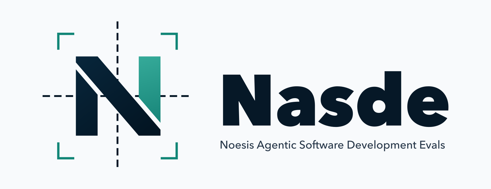
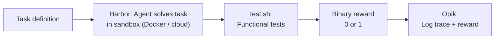
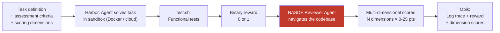

<div align="center">
  <a href="https://noesis.vision/nasde/"></a>

  <h3>Noesis Agentic Software Development Evals Toolkit</h3>

  <p>Measure whether your AI coding agent configuration actually improves code quality.</p>

  <a href="https://noesis.vision/nasde/"></a>
  <a href="https://discord.gg/QF5PMX4Dqg"></a>
  <br>
  <a href="https://github.com/NoesisVision/nasde-toolkit/actions/workflows/quality-gate.yml"></a>
  <a href="LICENSE"></a>
</div>

---

## What is NASDE?

NASDE is a **wrapper layer** over [Harbor](https://github.com/cased/harbor) (sandboxed agent execution — Docker locally or cloud providers for scaling) and [Opik](https://github.com/comet-ml/opik) (observability & experiment tracking). The backends are swappable — different execution engines or observability platforms can be plugged in.

What NASDE adds on top is the **"nasty" reviewer** — that's where the name comes from. After a coding agent completes a task and passes functional tests, NASDE deploys a separate **reviewer agent** (powered by Claude Code SDK) that freely navigates the produced codebase and scores it across multiple **dimensions** defined by the benchmark author. It checks not just whether the code works, but *how well* it's written according to your custom criteria.

## Why NASDE?

Agent configurations — `CLAUDE.md`/`AGENTS.md`/`GEMINI.md` files, skills, MCP servers — affect code quality, token usage, and task completion time. But without controlled benchmarks, you can't tell which changes help and which regress. NASDE gives you repeatable experiments: build tasks from your team's real git history, run different configurations against them, and compare multi-dimensional scores.

What you can measure:

| Area | What NASDE shows you |
|---|---|
| **Code quality** | Per-dimension scores (architecture, testing, clarity...) across configurations |
| **Consistency** | Score variance across trials — same config, same task, how stable? |
| **Token efficiency** | Which configurations produce similar quality at lower cost |
| **Agent comparison** | Same tasks, same rubric — Claude Code vs Codex vs Gemini |
| **Regressions** | Re-run benchmarks after config changes, compare against baseline |

## Standard vs NASDE evaluation flow

### Without NASDE (Harbor + Opik only)



The standard flow gives you a **binary pass/fail** — the code either works or it doesn't. No insight into *how* the agent solved the problem.

### With NASDE (agentic code review)



NASDE adds **Stage 2** — the reviewer agent analyzes the produced code against a rubric and returns scores across custom dimensions. This gives you a **multi-dimensional quality assessment**, not just pass/fail.

### Who defines the review criteria?

The **benchmark author** controls what the reviewer evaluates:

- **`assessment_dimensions.json`** — defines the scoring dimensions (e.g. *domain modeling*, *error handling*, *code quality*), each with a max score, typically summing to 100
- **`assessment_criteria.md`** (per task) — a detailed rubric describing what the reviewer should look for in each task

The reviewer agent freely navigates the workspace, reads source files, analyzes architecture, and returns structured scores for each dimension.

## Use cases

See **[Use Cases](docs/use-cases.md)** for detailed scenarios with workflows:

- **Evaluating your team's agent configuration** — mine your repo history for benchmark tasks, compare combinations of skills, `CLAUDE.md`, and MCP servers, run regression tests when configuration changes, compare results across different coding agents
- **Building and validating a universal skill** — curate diverse public repos, test one skill across many codebases and languages, compare agent behavior across different coding agents

## Example benchmark results

See **[Benchmark Results](docs/benchmark-results.md)** for full tables from the three included example benchmarks (refactoring, DDD architecture, project-specific setup). Key findings:

- **Claude and Codex perform comparably** on refactoring tasks (~81-83/100), but diverge on architectural challenges
- **Guidance helps Claude (+3.5) but hurts Codex (-22.0)** on DDD tasks — the same skill has opposite effects on different agents
- **Testing-focused skill** is the biggest lever for project-specific work (100% pass rate vs 67% vanilla)
- **LLM-as-a-Judge evaluator is consistent** — identical agent output produces identical scores (σ=0.0)

## When to use NASDE vs built-in evals

AI coding agents like Claude Code now ship built-in evaluation tools (e.g. Skill Creator evals) for testing individual skills. These are great for rapid iteration on a single skill. NASDE serves a different purpose:

| | Built-in evals (e.g. Skill Creator) | NASDE |
|---|---|---|
| **What you test** | One skill at a time | Full configuration (skill sets + `CLAUDE.md` + MCP) |
| **Agents supported** | The host agent only | Any agent via Harbor (Claude Code, Codex, Gemini CLI, Cursor, ...) |
| **Scoring** | Pass/fail, time, tokens | Multi-dimensional rubric (0–100, custom dimensions) |
| **Execution** | Agent's own session | Isolated Docker or cloud sandbox per trial |
| **Primary question** | "Does this skill trigger correctly?" | "Does this configuration produce better code?" |

Use built-in evals for rapid iteration on individual skills. Use NASDE when you need to evaluate complete configurations, compare across agents, or measure quality beyond pass/fail.

## Claude Code skills

NASDE ships with built-in [Claude Code skills](https://docs.anthropic.com/en/docs/claude-code/skills) that guide you through creating and running benchmarks interactively. When you open the project in Claude Code, these skills are available automatically:

| Skill | What it does |
|-------|-------------|
| **nasde-benchmark-creator** | Walks you through creating a new benchmark — from scaffolding the project, adding tasks with Docker environments and test scripts, to defining assessment dimensions and scoring criteria. |
| **nasde-benchmark-from-history** | Generates benchmark tasks by mining git history. Point it at a commit range or set of PRs, and it proposes tasks based on real problems your team already solved. |
| **nasde-benchmark-from-public-repos** | Curates diverse benchmark suites from public GitHub repositories. Describe the skill you're testing and it builds a diversity matrix, finds repos, and generates task scaffolding. |
| **nasde-benchmark-runner** | Guides running benchmarks, re-evaluating results, verifying Opik traces, and troubleshooting failures. Includes automatic Opik verification after each run. |

To get started, open the project directory in Claude Code and describe what you want to evaluate — the skills will take it from there.

## Installation

```bash
# Latest stable release (recommended)
uv tool install git+https://github.com/NoesisVision/nasde-toolkit.git@v0.1.1

# Latest development (HEAD)
uv tool install git+https://github.com/NoesisVision/nasde-toolkit.git

# From local clone (for development)
git clone git@github.com:NoesisVision/nasde-toolkit.git
cd nasde-toolkit
uv sync
```

After installation, only `nasde` appears on PATH. Harbor, Opik, and Claude Code SDK are bundled as core dependencies — no separate installation needed.

Check your installed version with `nasde --version`. Stable releases follow semver tags (e.g. `v0.1.1`); dev installs show versions like `0.1.2.dev3+gabcdef`.

## Quick start

```bash
# Set authentication for the agent you want to use:

# Claude Code (one of)
export ANTHROPIC_API_KEY=sk-ant-...
export CLAUDE_CODE_OAUTH_TOKEN=sk-ant-oat01-...

# OpenAI Codex
export CODEX_API_KEY=sk-...        # OpenAI API key (from platform.openai.com)

# Gemini CLI (one of)
export GEMINI_API_KEY=your-key     # Google AI Studio API key
export GOOGLE_API_KEY=your-key     # Google Cloud / Vertex AI

# 1. Scaffold a new evaluation project
nasde init my-benchmark

# 2. Run benchmark with Claude Code variant
nasde run --variant vanilla -C my-benchmark

# 3. Run benchmark with Codex variant
nasde run --variant codex-baseline --model gpt-5.3-codex -C my-benchmark

# 4. Run benchmark with Gemini CLI variant
nasde run --variant gemini-baseline --model google/gemini-3-flash-preview -C my-benchmark

# 5. Run specific tasks with Opik tracing
nasde run --variant vanilla --tasks my-task -C my-benchmark --with-opik

# 6. Skip assessment evaluation (Harbor only)
nasde run --variant vanilla -C my-benchmark --without-eval

# 7. Re-evaluate an existing job directory
nasde eval jobs/2026-03-13__14-30-00 --with-opik -C my-benchmark
```

## Cloud sandbox providers

By default, Harbor runs agents in **local Docker containers**. For horizontal scaling, you can use a cloud sandbox provider — this shifts command execution to the cloud, making trials I/O bounded rather than compute bounded. You can typically parallelize far above your local CPU count.

Supported providers (via Harbor):

| Provider | Flag value | API key env var |
|----------|-----------|-----------------|
| Docker (default) | `docker` | — |
| [Daytona](https://www.daytona.io/) | `daytona` | `DAYTONA_API_KEY` |
| [Modal](https://modal.com/) | `modal` | `MODAL_TOKEN_ID` + `MODAL_TOKEN_SECRET` |
| [E2B](https://e2b.dev/) | `e2b` | `E2B_API_KEY` |
| [Runloop](https://www.runloop.ai/) | `runloop` | `RUNLOOP_API_KEY` |
| [GKE](https://cloud.google.com/kubernetes-engine) | `gke` | GCP credentials |

We recommend **Daytona** for its flexibility and scaling capabilities.

```bash
# Run with Daytona cloud sandbox
export DAYTONA_API_KEY=...
nasde run --variant vanilla --harbor-env daytona -C my-benchmark

# Or use the Harbor pass-through for full control
nasde harbor run --dataset my-benchmark@1.0 --agent claude-code --model claude-sonnet-4-6 --env daytona -n 32
```

The cloud sandbox provider affects **only the Harbor trial execution** (Stage 1). The assessment evaluation (Stage 2) always runs locally on the host machine.

You can set a default provider in `nasde.toml`:

```toml
[defaults]
harbor_env = "daytona"
```

See the [Harbor documentation](https://harborframework.com/docs/cloud) for detailed provider configuration.

## Configuring the reviewer agent

The reviewer agent (assessment evaluator) is configurable via the `[evaluation]` section in `nasde.toml`. By default it uses `claude-opus-4-6` with read-only tools (`Read`, `Glob`, `Grep`).

### Model

Use the best available model for review quality:

```toml
[evaluation]
model = "claude-opus-4-6"   # Default — recommended for review quality
```

### Skills

Give the reviewer agent skills (e.g. a code review methodology). Create a directory with `SKILL.md` files:

```
my-benchmark/
  evaluator_skills/
    code-review/
      SKILL.md              # Review methodology, scoring principles
```

```toml
[evaluation]
skills_dir = "./evaluator_skills"
```

Skills are copied into the evaluator's workspace and loaded natively by Claude Code. The evaluator's prompt automatically adjusts to reference artifact paths correctly.

### MCP servers

Add external analysis tools (linters, complexity analyzers) as MCP servers:

```json
// evaluator_mcp.json
{
  "mcpServers": {
    "code-analysis": {
      "type": "stdio",
      "command": "npx",
      "args": ["@some-org/code-analysis-mcp"]
    }
  }
}
```

```toml
[evaluation]
mcp_config = "./evaluator_mcp.json"
allowed_tools = ["Read", "Glob", "Grep", "mcp__code-analysis__analyze"]
```

MCP tool names follow the `mcp__<server>__<tool>` convention. If you override `allowed_tools`, you must include the MCP tools explicitly.

### System prompt

Append custom instructions to the evaluator's system prompt:

```toml
[evaluation]
append_system_prompt = "Pay special attention to SOLID principles when scoring."
```

### All options

| Setting | Default | Purpose |
|---------|---------|---------|
| `model` | `claude-opus-4-6` | Evaluator model |
| `dimensions_file` | `assessment_dimensions.json` | Scoring dimensions file |
| `max_turns` | `30` | Max conversation turns |
| `allowed_tools` | `["Read", "Glob", "Grep"]` | Tool whitelist |
| `mcp_config` | — | Path to MCP server config JSON |
| `skills_dir` | — | Path to evaluator skills directory |
| `append_system_prompt` | — | Extra system prompt text |

## Local repo benchmarks

You can build benchmarks from local (private) repositories by setting `source.git` to a relative path:

```json
{
  "source": {
    "git": "../..",
    "ref": "abc1234"
  }
}
```

nasde auto-generates the Docker environment — no custom `Dockerfile` needed. See `examples/nasde-dev-skill/` for a complete example that tests nasde-toolkit itself.

## Commands

### Core

| Command | Description |
|---------|-------------|
| `nasde run` | Run benchmark: Harbor trial + assessment evaluation (default) |
| `nasde eval <JOB_DIR>` | Re-run assessment evaluation on an existing job |
| `nasde init [DIR]` | Scaffold a new evaluation project |

### Pass-through

| Command | Description |
|---------|-------------|
| `nasde harbor ...` | Full Harbor CLI (view, jobs resume, trials, datasets, etc.) |
| `nasde opik ...` | Opik CLI (configure, usage-report, export, etc.) |

### `nasde run` options

| Flag | Description |
|------|-------------|
| `--variant` | Variant to run (defaults to config default) |
| `--tasks` | Comma-separated task names to run |
| `--model` | Model override (e.g. `claude-sonnet-4-6`, `o3`, `google/gemini-3-flash-preview`) |
| `--timeout` | Agent timeout in seconds |
| `--with-opik` | Enable Opik tracing |
| `--without-eval` | Skip assessment evaluation |
| `--harbor-env` | Harbor execution environment (`docker`, `daytona`, `modal`, `e2b`, `runloop`, `gke`) |
| `--project-dir`, `-C` | Path to evaluation project |

## Project structure

A scaffolded project has the following layout:

```
my-benchmark/
  nasde.toml                  # Project configuration
  assessment_dimensions.json   # Scoring dimensions (shared across tasks)
  tasks/
    feature-a/
      task.json                # Task source + evaluation config
      instruction.md           # Agent prompt
      assessment_criteria.md   # Rubric for post-hoc evaluator
      tests/
        test.sh                # Harbor verification script
  variants/
    vanilla/                   # Claude Code variant
      variant.toml             # agent = "claude"
      CLAUDE.md                # Agent system prompt (injected to /app/CLAUDE.md)
    guided/                    # Claude Code variant with skills
      variant.toml             # agent = "claude"
      CLAUDE.md
      skills/                  # Claude skills (injected to /app/.claude/skills/)
        my-skill/
          SKILL.md
    codex-baseline/            # Codex variant
      variant.toml             # agent = "codex"
      AGENTS.md                # Codex instructions (injected to /app/AGENTS.md)
    codex-with-skills/         # Codex variant with skills
      variant.toml             # agent = "codex"
      AGENTS.md
      agents_skills/           # Codex skills (injected to /app/.agents/skills/)
        my-skill/
          SKILL.md             # Requires YAML frontmatter (name + description)
    gemini-baseline/           # Gemini CLI variant
      variant.toml             # agent = "gemini"
      GEMINI.md                # Gemini instructions (injected to /app/GEMINI.md)
    gemini-with-skills/        # Gemini CLI variant with skills
      variant.toml             # agent = "gemini"
      GEMINI.md
      gemini_skills/           # Gemini skills (injected to /app/.gemini/skills/)
        my-skill/
          SKILL.md
  evaluator_skills/            # Optional: skills for the evaluator agent
    code-review/
      SKILL.md
  evaluator_mcp.json           # Optional: MCP server config for evaluator
  jobs/                        # Trial output (gitignored)
```

Each variant must have a `variant.toml` declaring the agent type:

```toml
agent = "claude"   # or "codex" or "gemini"
```

### `nasde.toml`

```toml
[project]
name = "my-benchmark"
version = "1.0.0"

[defaults]
variant = "vanilla"
model = "claude-sonnet-4-6"
timeout_sec = 720
# harbor_env = "daytona"  # Optional: cloud sandbox provider

[docker]
base_image = "ubuntu:22.04"
build_commands = []

[evaluation]
model = "claude-opus-4-6"
dimensions_file = "assessment_dimensions.json"
# max_turns = 30                              # Max evaluator conversation turns
# allowed_tools = ["Read", "Glob", "Grep"]    # Override default tool whitelist
# mcp_config = "./evaluator_mcp.json"         # MCP server config for evaluator
# skills_dir = "./evaluator_skills"           # Skills directory for evaluator
# append_system_prompt = ""                   # Extra system prompt for evaluator

[reporting]
platform = "opik"
```

## Architecture

See [ARCHITECTURE.md](ARCHITECTURE.md) for the full system architecture with diagrams, and [docs/adr/](docs/adr/) for architectural decision records.

Key design: `nasde` is a **thin integration layer** over Harbor and Opik, not a replacement. Core flow uses their Python APIs directly; utility commands pass through to their CLIs unchanged. The underlying tools can be swapped in the future without changing the evaluation workflow.

## Authentication

NASDE auto-detects the required credentials based on the variant's agent type.

### Claude Code

The tool checks for auth tokens in this order:
1. `ANTHROPIC_API_KEY` environment variable
2. `CLAUDE_CODE_OAUTH_TOKEN` environment variable

On macOS, you can extract the OAuth token from your Claude Code keychain entry (created when you log in via `claude` CLI):

```bash
source scripts/export_oauth_token.sh
# ✓ CLAUDE_CODE_OAUTH_TOKEN exported (sk-ant-oat01-...)
```

This lets you use your Claude Pro/Max subscription instead of an API key.

### OpenAI Codex

Codex variants support two authentication methods:

**Option 1: ChatGPT subscription (OAuth)** — uses your ChatGPT Plus/Pro/Business plan credits, not API billing.

```bash
codex login                                # authenticate via ChatGPT (one-time)
source scripts/export_codex_oauth_token.sh # validate tokens are present
uv run nasde run --variant codex-vanilla -C my-benchmark
```

NASDE auto-detects `~/.codex/auth.json` with `auth_mode: "chatgpt"` and injects the full OAuth token structure into the sandbox. No env vars needed.

**Option 2: API key** — billed per-token through your OpenAI Platform account.

```bash
export CODEX_API_KEY=sk-...  # preferred
# or: export OPENAI_API_KEY=sk-...
```

API key always takes priority over OAuth when both are present.

### Gemini CLI

Gemini CLI variants support three authentication methods:

**Option 1: API key (Google AI Studio)** — billed per-token through your Google AI Studio account.

```bash
export GEMINI_API_KEY=your-key
```

**Option 2: Google Cloud / Vertex AI** — uses your Google Cloud project billing.

```bash
export GOOGLE_API_KEY=your-key
export GOOGLE_CLOUD_PROJECT=your-project
```

**Option 3: OAuth (Google account)** — uses your Gemini subscription credits.

```bash
gemini login                                  # authenticate via Google account (one-time)
source scripts/export_gemini_oauth_token.sh   # validate tokens are present
uv run nasde run --variant gemini-baseline -C my-benchmark
```

NASDE auto-detects `~/.gemini/oauth_creds.json` and injects the credentials into the sandbox. No env vars needed.

API key env vars (`GEMINI_API_KEY`, `GOOGLE_API_KEY`, `GOOGLE_APPLICATION_CREDENTIALS`) always take priority over OAuth when present.

### Opik tracing

For Opik tracing, set credentials in `.env` (in project dir or parent):
```
OPIK_API_KEY=...
OPIK_WORKSPACE=...
```

The Opik project name is automatically set to the benchmark name (from `nasde.toml [project] name`).

## Prerequisites

- **Python 3.12+**
- **Docker** (default) or a cloud sandbox provider — Harbor runs agents in isolated environments
- **uv** — Package manager
- **npm** — Required for Gemini CLI (`@google/gemini-cli` is installed automatically by Harbor)
- **Agent credentials** (at least one):
  - Claude Code: `ANTHROPIC_API_KEY` or `CLAUDE_CODE_OAUTH_TOKEN`
  - OpenAI Codex: `CODEX_API_KEY` (API key) or `codex login` (ChatGPT subscription OAuth)
  - Gemini CLI: `GEMINI_API_KEY` (API key), `GOOGLE_API_KEY` (Vertex AI), or `gemini login` (Google account OAuth)
- **ANTHROPIC_API_KEY** or **CLAUDE_CODE_OAUTH_TOKEN** — Also required for the assessment evaluator (which always uses Claude Code SDK)

## Verifying Opik results

```python
import urllib.request, json

req = urllib.request.Request(
    "https://www.comet.com/opik/api/v1/private/traces?project_name=<PROJECT>&limit=1",
    headers={
        "authorization": "<OPIK_API_KEY>",
        "Comet-Workspace": "<WORKSPACE>",
    },
)
resp = json.loads(urllib.request.urlopen(req).read())
scores = resp["content"][0].get("feedback_scores", [])
for s in sorted(scores, key=lambda x: x["name"]):
    print(f"  {s['name']}: {s['value']}")
```

Expected feedback scores after a full run with `--with-opik`:
- `arch_<dimension>` (e.g. `arch_domain_modeling`) — normalized 0.0-1.0
- `arch_total` — overall architecture score
- `reward` — Harbor functional test result (0.0 or 1.0)
- `duration_sec` — trial duration

## Community

Have questions, want to share your benchmarks, or discuss AI agent evaluation strategies? Join our Discord community — we'd love to hear from you!

[](https://discord.gg/QF5PMX4Dqg)
