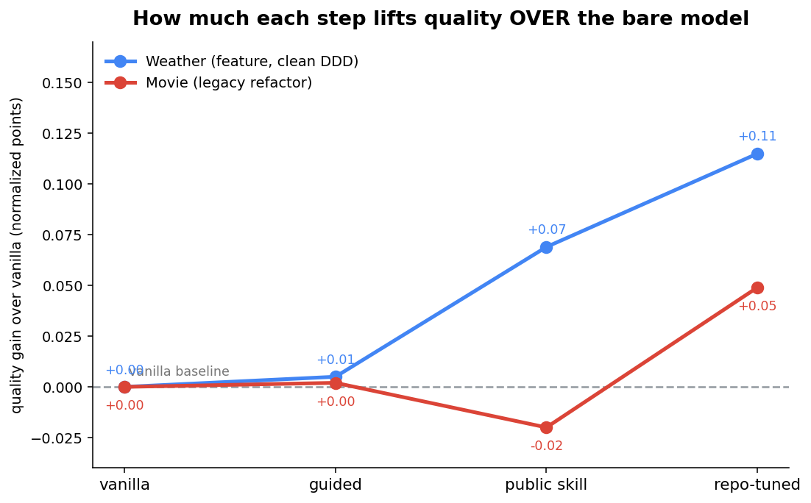
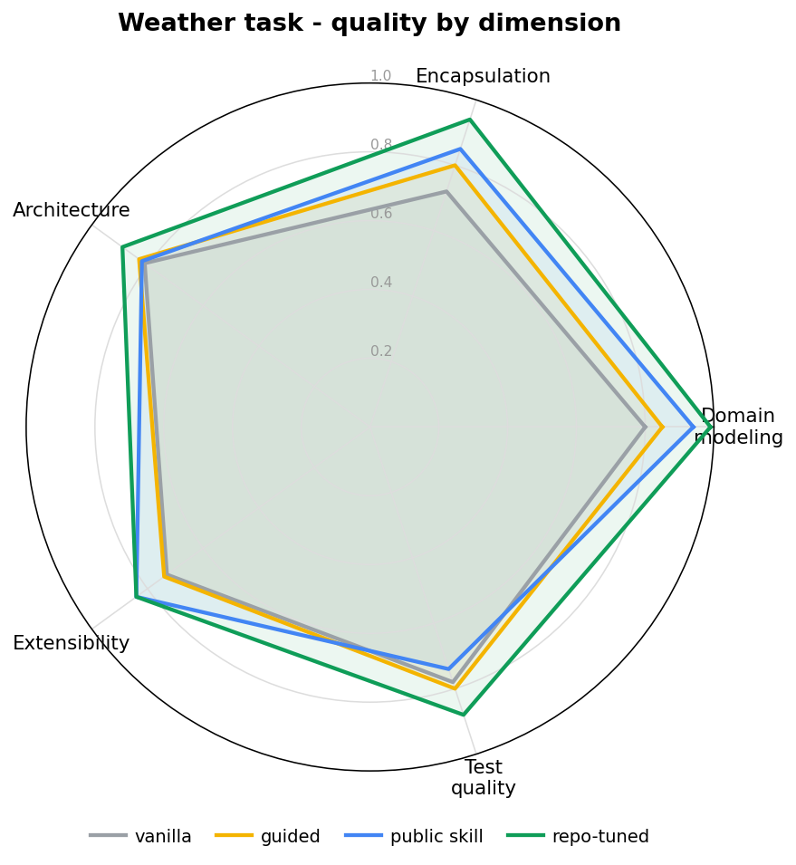
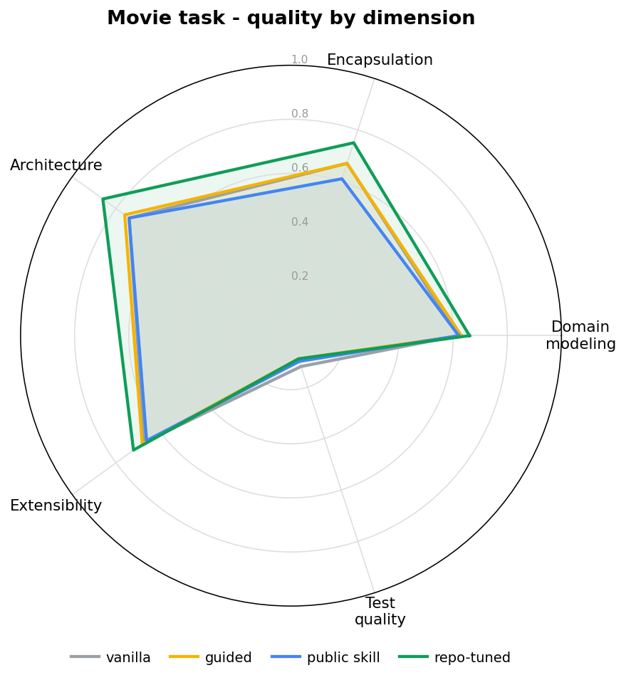
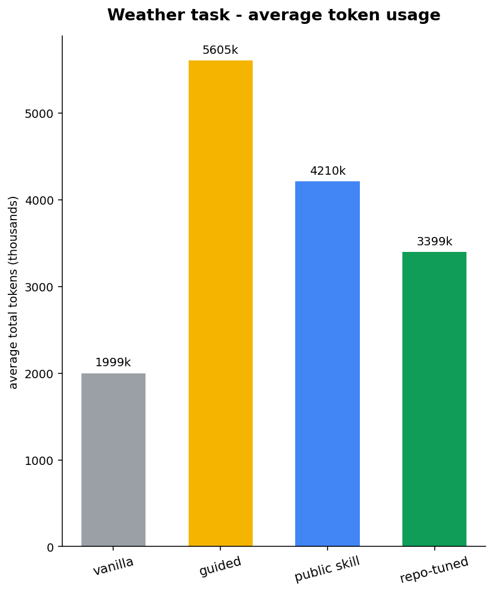
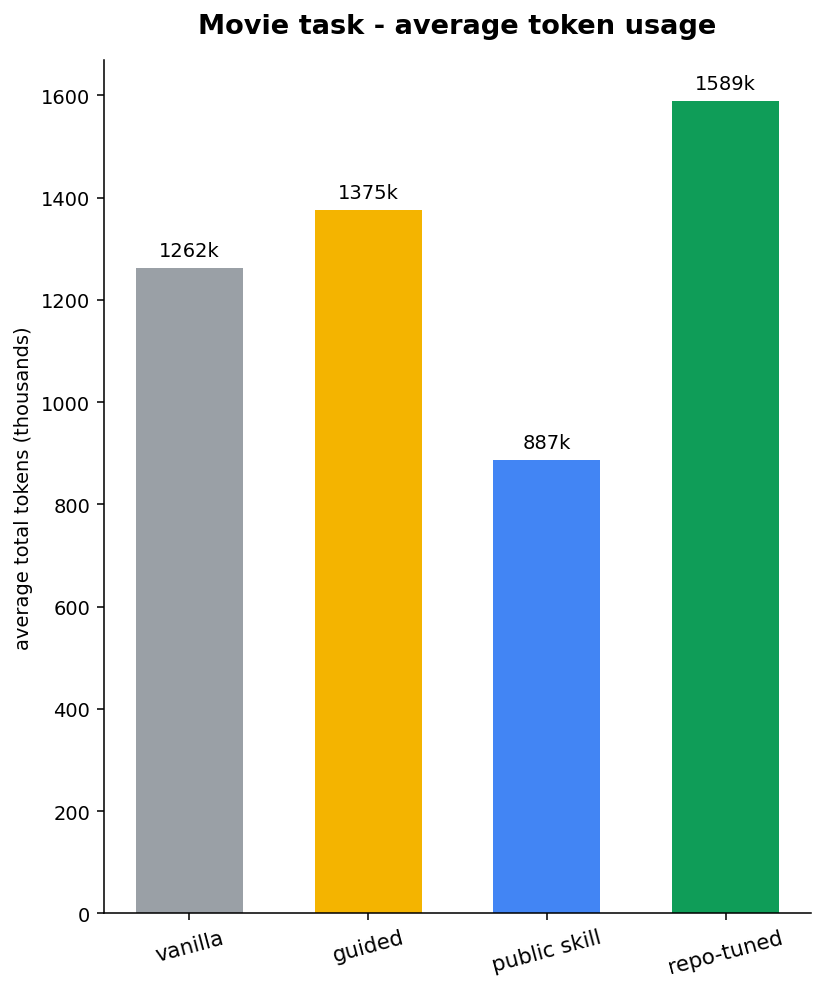
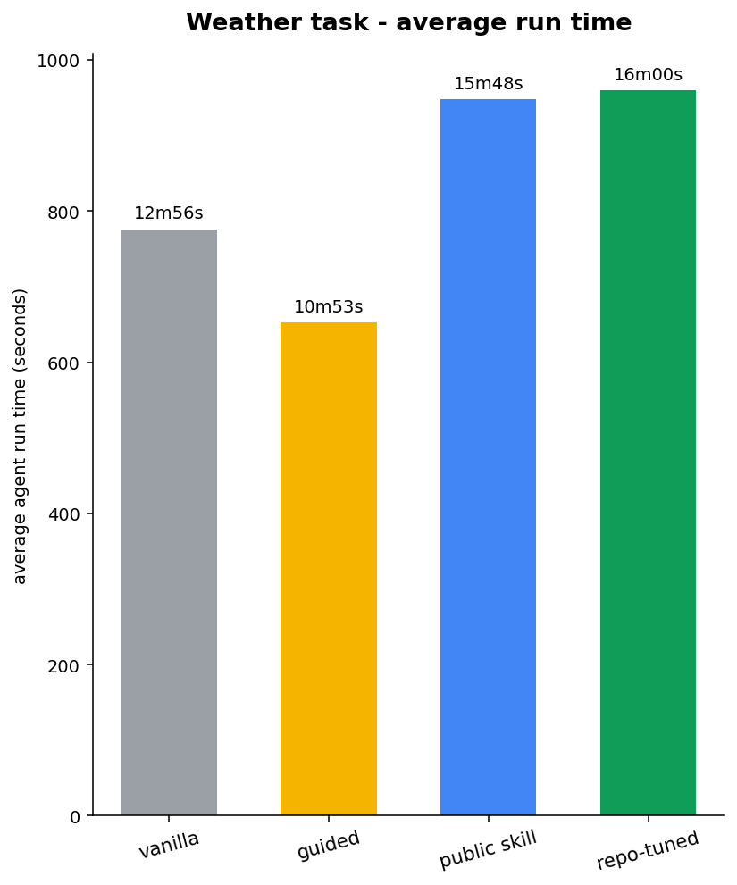
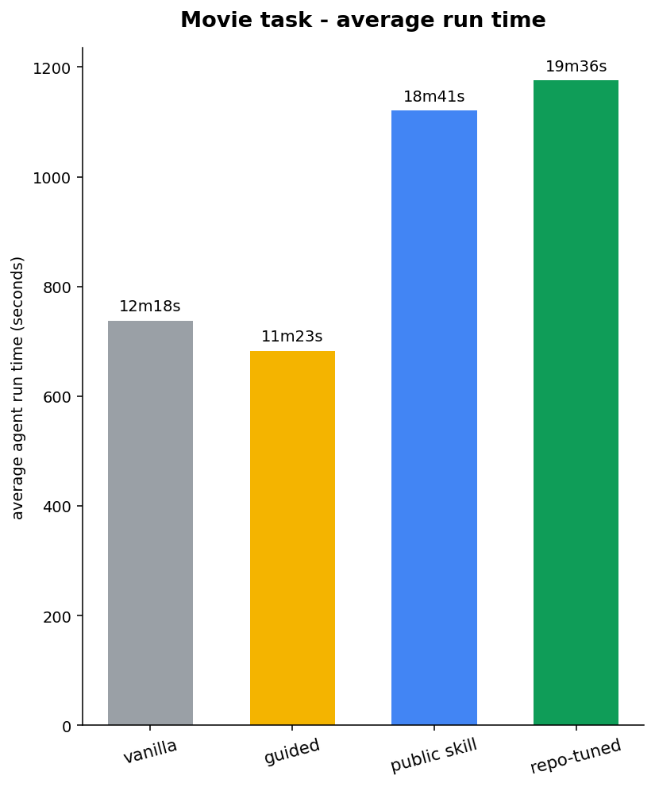

# Example Benchmark Results

Results from the three example benchmarks included in `examples/`. All scores are means across independent trials, assessed by Claude Opus 4.6 (Sonnet 4.6 for nasde-dev-skill) against structured per-task rubrics.

**Agents tested:** Claude Code (claude-sonnet-4-6) and OpenAI Codex (gpt-5.3-codex).

## UC2: Universal Skill Validation — Refactoring

4 tasks: Java + Python refactoring katas (Extract Hierarchy, Break Dependency, Polymorphism, Extract Method).

| Variant | Trials | Pass Rate | Behavior (30) | Clarity (25) | Technique (25) | Scope (20) | Total (100) |
|---|:---:|:---:|:---:|:---:|:---:|:---:|:---:|
| claude-vanilla | 12 | 58% | 24.6 | 20.2 | 18.5 | 17.9 | **81.2** |
| claude-refactoring-skill | 12 | 50% | 22.9 | 19.3 | 17.8 | 17.5 | **77.6** |
| codex-vanilla | 8 | 62% | 25.0 | 20.5 | 19.6 | 16.5 | **81.6** |
| codex-refactoring-skill | 8 | 50% | 24.4 | 21.5 | 19.4 | 17.8 | **83.0** |

**Takeaway:** Both agents perform comparably on refactoring tasks (81-83 range). The refactoring skill does not provide measurable improvement — these tasks may be well within both agents' baseline capabilities.

## UC2: Universal Skill Validation — DDD Architectural Challenges

4 tasks: Java + C# domain modeling (Order Dispatch, Anemic-to-Rich, Threshold Discount, Weather Discount).

| Variant | Trials | Pass Rate | Domain (25) | Encaps. (20) | Arch. (20) | Extens. (15) | Tests (20) | Total (100) |
|---|:---:|:---:|:---:|:---:|:---:|:---:|:---:|:---:|
| claude-vanilla | 12 | 75% | 17.1 | 11.2 | 16.1 | 9.5 | 7.7 | **61.6** |
| claude-guided | 12 | 75% | 17.4 | 12.4 | 16.6 | 10.0 | 8.7 | **65.1** |
| codex-vanilla | 9 | 89% | 18.8 | 13.8 | 16.8 | 11.4 | 8.7 | **69.4** |
| codex-guided | 8 | 50% | 11.5 | 9.6 | 12.9 | 7.4 | 6.0 | **47.4** |

**Takeaway:** Architectural guidance helps Claude (+3.5) but dramatically hurts Codex (-22.0). The same skill applied to different agents can have opposite effects — this is exactly the kind of insight NASDE is designed to surface.

### Deep dive — tactical-ddd skill: public vs repo-tuned (Claude Code)

A focused follow-up on the same benchmark family: we took a public DDD skill ([`tactical-ddd` from `ntcoding/claude-skillz`](https://github.com/NTCoding/claude-skillz)) and a repo-tuned version, and measured four configurations of Claude Code on two deliberately different tasks — a **feature on a clean DDD codebase** (`ddd-weather-discount`) and a **legacy anemic→rich refactor** (`csharp-movie-rental-anemic`). Each configuration was run repeatedly and each run scored repeatedly; the numbers below are averages (normalized 0–1). Skill activation was verified per run — a mounted skill the agent never invokes scores like no skill at all.

| Configuration | Weather (feature) | Movie (legacy) |
|---|:---:|:---:|
| vanilla (no skill) | 0.79 | 0.56 |
| guided (manual DDD hints, no skill) | 0.80 | 0.57 |
| public skill | 0.86 | 0.54 |
| repo-tuned skill | **0.91** | **0.61** |

**The effect is task-dependent — and the comparison that matters is against the bare model, not between skills.** Absolute scores across tasks aren't comparable (task difficulty sets the baseline; movie starts lower because it's harder), so we compare the **increment over vanilla** on each task and only call a gap real when its 95% confidence interval (percentile bootstrap on per-attempt means) excludes zero. On both tasks the **repo-tuned skill significantly beats the bare model** (+0.12 weather, +0.05 movie) and beats hand-written hints. The **public skill helps only on the clean feature** (+0.07, significant); on the legacy refactor it doesn't beat vanilla at all. Hand-written hints (`guided`) never clear the bar — about the same as no skill.

  

On the clean feature every step lifts quality (public +0.07, repo-tuned +0.12). On the legacy refactor only the repo-tuned skill clears the line (+0.05); the public skill dips just below vanilla — off-the-shelf doesn't help where the task fixes the design shape, and tuning is what recovers a gain.

Per-dimension radars show *where* the gains land (test quality stays flat everywhere — the skill teaches modeling, not testing):

  
  

This is where the per-dimension view earns its keep, and it changes the Movie story. The aggregate says the repo-tuned skill barely moved on Movie (+0.05) — but per dimension it significantly lifts **four of five**: architecture (+0.12), encapsulation (+0.08), domain modeling (+0.04), extensibility (+0.05). What flattens the headline is the fifth dimension — test quality actually drops (−0.035, also significant) because the skill teaches domain design, not testing, and that one axis drags the average back down. So "barely moved" is an artifact of averaging: on the legacy refactor the skill *does* rebuild the code, it just doesn't touch tests. (Full per-dimension significance, both methods, in the tables linked below.)

What does the gain cost? Token usage and run time per configuration — and the answer is **not** the simple "better costs more" you might expect:

  
  
  
  

Cost doesn't track quality. On weather the top-scoring repo-tuned skill spends *fewer* tokens than guided or public; on movie the public skill is the cheapest of all four in tokens. The real overhead is run time on the messy refactor, where the skill arms run noticeably longer than the bare model (~1.5–1.6×). Dollar cost is deliberately not estimated.

**Two lessons that generalize:** (1) judge one aggregate number and you miss the story — a real per-dimension gain hides inside an averaged score, which is why we show radars, not a single bar; (2) a skill present on disk is not a skill used — always verify it activated before trusting the result.

**Significance.** Gaps are called real only when a 95% confidence interval (percentile bootstrap on per-attempt means) excludes zero. Full per-dimension tables are here:
- [Per-dimension significance — bootstrap](../examples/ddd-architectural-challenges/SIGNIFICANCE-per-dimension-bootstrap.md)
- [Per-dimension significance — Bayesian bootstrap vs bootstrap](../examples/ddd-architectural-challenges/SIGNIFICANCE-per-dimension-bayes-vs-bootstrap.md) (the two methods agree on every aggregate verdict)

## UC1: Project-Specific Setup — NASDE Dev Skill

1 task: Add multi-attempt support to the nasde-toolkit itself. Claude only (project-specific skill, cross-agent comparison not applicable).

| Variant | Trials | Pass Rate | Verification (25) | Conventions (25) | Architecture (25) | Documentation (25) | Total (100) |
|---|:---:|:---:|:---:|:---:|:---:|:---:|:---:|
| claude-vanilla | 3 | 67% | 0.0 | 21.7 | 25.0 | 18.0 | **64.7** |
| claude-nasde-dev-with-testing | 3 | 100% | 8.0 | 21.7 | 25.0 | 14.7 | **69.3** |
| claude-nasde-dev-with-arch | 3 | 33% | 0.0 | 20.0 | 25.0 | 18.0 | **63.0** |
| claude-nasde-dev-full-stack | 3 | 33% | 2.7 | 18.3 | 24.0 | 12.0 | **57.0** |

> Evaluator: Claude Sonnet 4.6 (not Opus).

**Takeaway:** The testing-focused skill is the only variant that improves both pass rate (67% -> 100%) and adds verification discipline. Combining too many skills (full-stack) actually hurts performance — less is more.

## Evaluator Consistency

The LLM-as-a-Judge evaluator shows high scoring consistency:

- **Objective dimensions** (behavior preservation, architecture compliance): σ < 2.5 across repeated trials
- **Subjective dimensions** (refactoring technique, test quality): σ = 5-7
- **Identical agent output produces identical scores**: `claude-nasde-dev-with-arch` scored 63/63/63 across 3 independent trials (σ=0.0)

Observed variance is dominated by agent output differences and task difficulty, not evaluator noise.

## Methodology

- Claude variants: 3 independent trials per task. Codex variants: 2 trials per task.
- Each trial runs the agent in an isolated Docker container with fresh source code.
- Pass rate = percentage of trials where functional tests passed (Harbor verifier reward = 1.0).
- Assessment scores are means across all trials for a variant, including failed trials (scored as 0).
- Container memory: 4096 MB. Agent timeout: per task.toml (1200-1800s).
