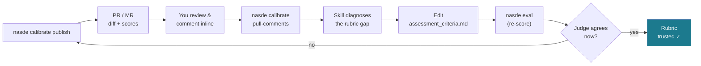

## Why calibrate

The reviewer agent scores trials against a rubric (`assessment_criteria.md` per task, `assessment_dimensions.json` benchmark-wide) — but an LLM judge is an imperfect grader, and the way it reads your rubric can drift from how *you* would grade the code. Before you trust a benchmark, you want to eyeball the actual diffs next to the scores and tighten the rubric wherever the judge and your own judgment disagree. `nasde calibrate` turns that into a loop you run in your normal review tool: GitHub or GitLab.



It's a **measure → diagnose → fix → re-measure** loop — the same shape that makes any rubric trustworthy. The steps below walk it once.

## Set up the sink repo

```toml
# in nasde.toml
[calibration]
repo = "https://github.com/YourOrg/nasde-calibration"   # a private sink repo you already created
```

## Publish a trial as a PR

```bash
nasde calibrate publish jobs/2026-03-13__14-30-00/movie__abc -C my-benchmark
```

Each trial becomes **one Pull/Merge Request** against an orphan base branch that holds the codebase in the exact state the agent started from. The PR diff is therefore *exactly the agent's work* — clean to read and navigate — and the PR description renders the reviewer's per-dimension scores (`mean ± std`) with a link to the full reasoning. Alongside the diff, a `.calibration/` directory carries the context a reviewer needs to judge fairly: the task's `instruction.md` (what the agent was asked to do), the `assessment_criteria.md` and `assessment_dimensions.json` the judge scored against, every `assessment_eval_<N>.json` (the per-dimension reasoning behind each repetition), `assessment_summary.json`, and `metrics.json`.

## Review and comment

You review the diff, and **wherever a score disagrees with your judgment you comment inline** ("this should score higher — the model isn't anemic here because…"). Add a colleague as a repo collaborator and they can comment too.

## Pull comments back

```bash
nasde calibrate pull-comments jobs/2026-03-13__14-30-00/movie__abc -C my-benchmark --json
```

This pulls your comments back. The `nasde-benchmark-calibration` skill then lines each comment up against the judge's score for that dimension, diagnoses *why* the rubric produced the divergent score, and proposes a concrete edit to `assessment_criteria.md` for your approval. Re-run the trial, re-publish, and confirm the judge now agrees — the measure → diagnose → fix → re-measure loop that makes a rubric trustworthy.

## Things worth knowing

- **The platform is auto-detected from the repo URL** — `github.com` uses the `gh` CLI, GitLab uses `glab`. You need the matching CLI installed and logged in (`gh auth login` / `glab auth login`); Nasde never handles your token. A self-hosted GitLab host that isn't obviously "gitlab" can be forced with `[calibration] platform = "gitlab"`.
- **Re-running is idempotent** — a trial whose **open** PR/MR already exists is skipped, so you can publish more trials into the same sink without duplicates. Once you close a calibration round, the same trials can be re-published into a fresh round (a closed PR no longer blocks).
- **The sink repo must already exist** — Nasde pushes branches and opens PRs but does not create repositories. One base branch is seeded per `(repo, commit)` and shared by all that source's trials.
