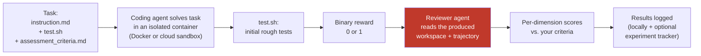
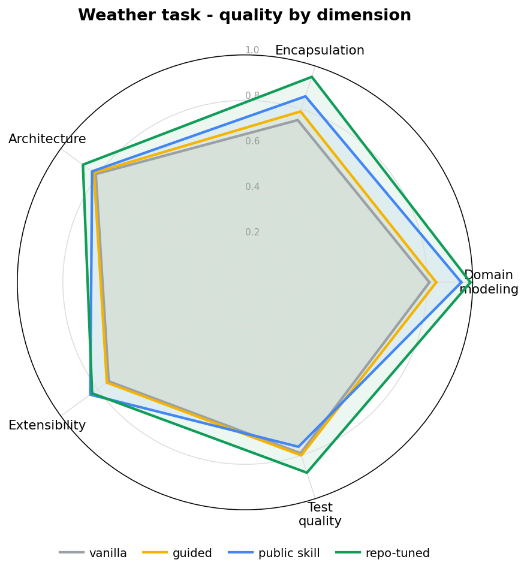

The question that trips most people up is *how* Nasde scores a run. The short answer: there are **two independent kinds of scoring**, and they answer different questions. The rest of this page explains both, then walks the whole pipeline stage by stage.

## Two independent kinds of scoring

- **Rough tests — a deterministic pass/fail.** A shell script you write (`tests/test.sh`) runs after the agent finishes and emits a binary reward, `1` or `0`. Nothing AI about it. It gives a hard yes/no on correctness, but says nothing about *how good* the result is.
- **Multi-dimensional assessment — an LLM-as-a-Judge.** A second coding agent reads the produced workspace and scores it on the dimensions *you* defined (e.g. *Domain Modeling*, *Test Quality*), with written reasoning. This is the part that turns "did it pass?" into "how good is it, on the axes I care about?"

Rough tests catch black-and-white failures. The reviewer catches everything else — whether the workspace is well-structured, respects your architecture, has meaningful tests (not coverage padding), whether a generated document is clear or a migration reversible. You need both. The stages below show where each one sits.

## The pipeline, end to end

One `nasde run` command drives this whole chain. Stage 1 (the agent doing the work in a sandbox) comes from [Harbor](https://www.harborframework.com/); the optional tracking stage at the end uses [Opik](https://github.com/comet-ml/opik). Nasde is the glue that connects them, adds the reviewer stage in between, and gives you the CLI, the benchmark project layout, and the [authoring skills](/nasde-toolkit/getting-started/quick-start/).

## 1. The task — what you define

A task is a directory of plain files, and they are the only things you author:

- **`instruction.md`** — what the agent is asked to do, in prose. This is the *problem*, never the solution — it describes the goal, not the diff.
- **`environment/`** (a `Dockerfile`, or an auto-generated one from `[nasde.source]`) — the starting state of the codebase. Every run begins from this exact snapshot, so two configurations are compared on identical ground.
- **`tests/test.sh`** — the deterministic verifier (Stage 3 below).
- **`assessment_criteria.md`** + a benchmark-wide **`assessment_dimensions.json`** — the rubric the reviewer scores against (Stage 5 below).

You don't have to write all of these by hand — the [authoring skills](/nasde-toolkit/getting-started/quick-start/) scaffold them, including mining real tasks from your git history. See [Configuration](/nasde-toolkit/reference/configuration/) for the full layout and file formats.

## 2. The agent solves it — in an isolated sandbox

Nasde hands the task to the coding agent under test (Claude Code, Codex, or Gemini CLI) running inside a fresh, isolated container — locally on Docker by default, or on a [cloud sandbox provider](/nasde-toolkit/guides/running-benchmarks/) for horizontal scale. Isolation matters for two reasons:

- **Safety** — the agent can `rm -rf`, install arbitrary packages, or loop your test suite without touching your machine.
- **Fairness** — every trial starts from the same clean state, so a score difference reflects the *configuration* (the `CLAUDE.md`, the skill, the MCP server, the model, the reasoning effort), not leftover state from a previous run.

What varies between runs is exactly one thing: the **variant** — the agent configuration you're testing. That's how Nasde turns "did my skill help?" into a controlled experiment. See [Configuration → variant.toml](/nasde-toolkit/reference/configuration/) for what a variant can change.

## 3. Rough tests — a deterministic pass/fail

When the agent finishes, `tests/test.sh` runs inside the container and writes a binary reward — `1` (pass) or `0` (fail). What "passing" means is entirely up to you:

- For a bug-fix task: *"the regression test that was failing now passes"*
- For a refactor: *"the existing test suite still passes — no behavior change"*
- For a feature: *"the new integration test I wrote passes"*

This is the standard verifier pattern used by [Harbor](https://www.harborframework.com/) and other coding-agent benchmarks. It gives a hard yes/no on correctness — but says nothing about *how good* the result is. That's the gap the next stage fills.

## 4. The reviewer agent — reading the actual work

This is the stage Nasde adds, and it's why the pipeline exists. A **second coding agent** (`claude` or `codex`) is pointed at the produced workspace and navigates it with real tools — `Read`, `Glob`, `Grep`, optionally MCP analysis servers — reading only what each dimension needs rather than stuffing the whole repo into a prompt. That's what keeps the review tractable on large codebases. It can also read the agent's full **trajectory** (tool calls, tokens, timing), so your criteria can judge the *process*, not just the final files.

The reviewer's reference point is **two files you write** when creating the benchmark:

| File | What goes in it | Who writes it |
|---|---|---|
| `assessment_dimensions.json` | The list of dimensions to score on (e.g. *Domain Modeling*, *Test Quality*, *Documentation Clarity*), plus a max score per dimension | You — once, shared across all tasks in the benchmark |
| `assessment_criteria.md` | Per-task criteria: for each dimension, what a low score looks like, what a high score looks like, what specific things to check | You — once per task, in plain prose |

You decide how strict the criteria are — spell out a ground-truth structure, enumerate exact checks, or leave room for judgment. Whatever gives you a signal you trust.

## 5. Per-dimension scores — against your rubric

The reviewer scores each dimension on whatever scale you chose, with written reasoning for each. One local `nasde run` handles all of it — no separate LLM-as-a-judge stack required.

**The reviewer runs more than once.** An LLM judge is non-deterministic — score the same workspace twice and you can get 0.61 then 0.71. So by default Nasde evaluates each trial **3 times** (`eval_repetitions`, set in `nasde.toml [evaluation]` or with `--eval-repetitions`) and reports the **mean** rather than any single run. Each evaluation is kept as its own `assessment_eval_<N>.json`; a derived `assessment_summary.json` holds the per-dimension mean, standard deviation, and range. Means are computed only within a single judge model **and a single rubric** — a Claude review and a Codex review are different benchmarks, and so is a review run after you edited `assessment_dimensions.json` (the rubric is fingerprinted, so changing a dimension, its `max_score`, or even its description starts a fresh cluster rather than silently mixing incomparable scores). After editing the rubric, just re-run `nasde eval` — the new evaluations form their own cluster automatically.

When the judge's scores feel off, you can align it with your own judgment — see [Calibrating the Rubric](/nasde-toolkit/concepts/calibration/).

Per-dimension scoring is what catches the things a single pass/fail number would hide. A radar makes it concrete — the same workspace can score high on one dimension and low on another:

That spread (strong on architecture, weak on test quality, say) is the signal you lose the moment you collapse everything into one average. See [A Real Task](/nasde-toolkit/concepts/real-task-example/) and [Benchmark Results](/nasde-toolkit/guides/benchmark-results/) for the full picture.

## 6. Results — logged locally, optionally tracked

Every trial writes its artifacts to a local `jobs/` directory: the scores, per-dimension reasoning, [token & cost economics](/nasde-toolkit/concepts/token-cost/), the code diff, and the trajectory. The `nasde run` summary prints a per-configuration table (score, tokens, cost). With `--with-opik` the scores also flow to an [Opik](https://github.com/comet-ml/opik) dashboard for browsing and comparison across runs, and [`nasde results-export`](/nasde-toolkit/guides/running-benchmarks/) copies the analytic essence out of `jobs/` into any plain directory you want to keep.
