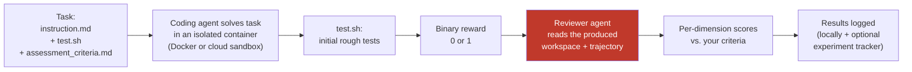

Stage 1 (the agent does the work in a sandbox) comes from [Harbor](https://www.harborframework.com/). The optional experiment-tracking stage at the end uses [Opik](https://github.com/comet-ml/opik). NASDE is the glue that connects them and adds the reviewer stage in between — plus the CLI, the benchmark project layout, and the [authoring skills](/nasde-toolkit/getting-started/quick-start/).
