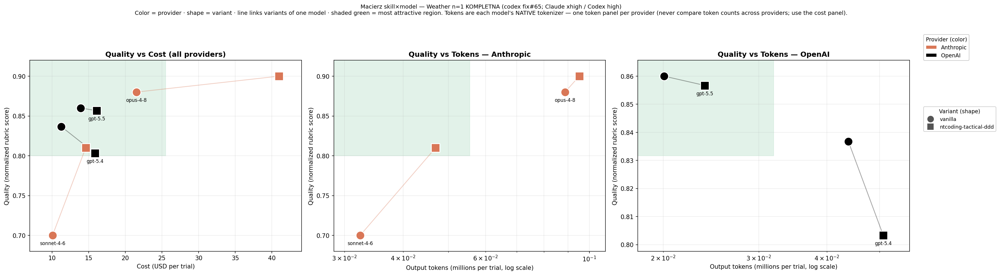

A passing test tells you the agent *can* do the task. It doesn't tell you what that capability **costs**. NASDE records, for every trial, how many tokens the agent burned and what that would cost in dollars.

## The raw signals

NASDE records the raw quality, token, and cost signals you need to compare agents and models:

- **token usage** — total input + output tokens for the run (price-independent; a measure of how much the model "thinks" to reach a given quality).
- **cost (USD)** — what those tokens cost at catalog rates. The number that matters when you're choosing a model for a budget.

These appear in three places: the `nasde run` summary prints a per-`(agent, model, effort)` table (trials, score, tokens, $cost — with an inter-trial `±std` on cost and tokens once a group has 2+ trials, a bare value at n=1); `assessment_summary.json` carries them per trial; and `results-export` copies them into `metrics.json`.

## Quality vs. cost: the Pareto frontier

This is the comparison that actually drives a model choice. NASDE measures quality and cost **independently** so you can see the *trade-off* — which model gives you the best quality for your budget — instead of collapsing it into one number that hides the picture.

Why not a single "efficiency" ratio (quality per dollar)? Because that ratio has an arbitrary zero — a score of 0 means an empty rubric, which no real run reaches — so the same data can re-order which model "wins" just by shifting where you put that zero. The trade-off is shift-invariant; a single ratio is not.

So NASDE plots the raw signals as a **Pareto frontier** (quality vs. cost, and quality vs. tokens). Models on the frontier are the best available trade-offs; a model above it is overpaying for its quality, one below it is buying cheap quality. *You* pick the point on the frontier that matches your budget and quality bar.

<!-- TODO(image): pareto.png — a 2-D scatter, quality (normalized score, Y) vs. cost in USD (X), with 4–5 model points (e.g. Claude Sonnet/Opus, Codex, Gemini) and the Pareto frontier drawn as a line. Generate from real run data via the nasde-benchmark-runner skill's scripts/pareto.py and drop into website/src/assets/benchmark/pareto.png, then add:
 -->

:::note[Chart coming]
A worked quality-vs-cost Pareto chart will live here. For now, the token and time charts in [Benchmark Results](/nasde-toolkit/guides/benchmark-results/) show the raw cost signals per configuration.
:::

The Pareto comparison and the chart generator live in the `nasde-benchmark-runner` skill.

## A mean is never reported bare

The summary table shows `Score` as `mean ±std` across trials — the standard deviation between repeated runs (agent noise: the agent writes different code each time). A single trial reads `mean (n=1)`, an explicit single-run flag rather than a fake `±0.00`, and the `Trials` column is the sample size. The other noise source — the judge scoring the *same* code differently — is per-trial, so it lives in `metrics.json` (`score_eval_std`, `score_eval_n`, `single_eval`). Keeping the two apart is the point: is a gap bigger than the run-to-run wobble, or just noise? (Bootstrap/Bayesian significance testing is a separate, offline step — this surfaces the spread and `n` that make a mean honest.)

## How cost is computed — "as if every run were the first"

The full input volume (prompt tokens, cache included) is billed at the full catalog rate, with *no* cache discount, and the model's reasoning tokens are counted as output. This is deliberate: the prompt-token count is fixed for a task, but the cache hit rate drifts with run order and timing — so billing the full volume keeps cost **deterministic and comparable across runs**, not a function of how warm your cache happened to be.

## Pricing is yours to keep current

Rates live in a small, versioned `pricing.toml` bundled with NASDE, each model stamped with the date and source it came from. A model that isn't in the catalog still gets token metrics — only its `cost_usd` is left blank (with a warning), never a wrong number. To add or update a model, edit `pricing.toml`:

```toml
[models."your-model-id"]
input_per_1m = 3.0
output_per_1m = 15.0
as_of = "2026-06-08"
source = "https://…"
```

:::caution[Confirm rates before quoting costs]
The bundled catalog is a convenience, not a billing authority — re-check against the provider's current rate card before publishing any dollar figure.
:::
