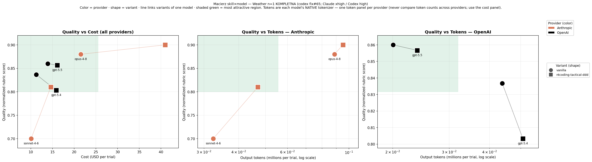

A passing test tells you the agent *can* do the task. It doesn't tell you what that capability **costs**. Nasde records, for every trial, how many tokens the agent burned and what that would cost in dollars.

## The raw signals

Nasde records the raw quality, token, and cost signals you need to compare agents and models:

- **token usage** — total input + output tokens for the run (price-independent; a measure of how much the model "thinks" to reach a given quality).
- **cost (USD)** — what those tokens cost at catalog rates. The number that matters when you're choosing a model for a budget.

These appear in three places: the `nasde run` summary prints a per-`(agent, model, effort)` table (trials, score, tokens, $cost — with an inter-trial `±std` on cost and tokens once a group has 2+ trials, a bare value at n=1); `assessment_summary.json` carries them per trial; and `results-export` copies them into `metrics.json`.

## Quality vs. cost: the Pareto frontier

This is the comparison that actually drives a model choice. Nasde measures quality and cost **independently** so you can see the *trade-off* — which model gives you the best quality for your budget — instead of collapsing it into one number that hides the picture.

Why not a single "efficiency" ratio (quality per dollar)? Because that ratio has an arbitrary zero — a score of 0 means an empty rubric, which no real run reaches — so the same data can re-order which model "wins" just by shifting where you put that zero. The trade-off is shift-invariant; a single ratio is not.

So Nasde plots the raw signals as a **Pareto frontier** (quality vs. cost, and quality vs. tokens). Models on the frontier are the best available trade-offs; a model above it is overpaying for its quality, one below it is buying cheap quality. *You* pick the point on the frontier that matches your budget and quality bar.



A real example from a skill×model matrix. **Left panel — quality vs. cost (USD), all providers together**, because dollars are a fair common unit. Color is the provider, marker shape is the variant (circle = vanilla, square = with the skill), and a line links a model's variants. The shaded region is the most attractive corner (high quality, low cost). **The two right panels are quality vs. tokens, one per provider** — token counts use each provider's native tokenizer and are *not* comparable across providers, so they never share a panel. Reading the left panel, `gpt-5.4` and `sonnet-4-6` sit cheap-but-lower, `opus-4-8` buys the top score at the highest cost — which one "wins" depends entirely on where your budget and quality bar fall.

The Pareto comparison and the chart generator live in the `nasde-benchmark-runner` skill.

## Why scores come with a ± (and why that matters)

A benchmark score is never perfectly repeatable — run the same setup twice and you'll get slightly different numbers. So a bare average can lie: if config A scores 0.82 and config B scores 0.80, is A *really* better, or did it just get lucky this time? To answer that honestly, you need to know **how much the score wobbles**. That's why Nasde always reports a score as **`mean ±std`** — the average, plus the typical wobble around it.

There are **two separate sources of wobble**, and Nasde keeps them apart on purpose:

- **The agent writes different code each time.** Ask the same agent to solve the same task twice and it won't produce identical code, so the scores differ. This wobble shows up as the **`±std` in the run summary table**, measured *across your attempts* (the `Trials` column is how many attempts went into the average). Run more attempts — `--attempts` — and this estimate gets sharper. A single attempt is shown honestly as `mean (n=1)`, not a fake `±0.00`.

- **The judge scores the same code slightly differently each time.** Even on identical code, the reviewer isn't perfectly consistent. This is a *different* wobble, so it's recorded *per trial* in `metrics.json` (`score_eval_std`, `score_eval_n`).

Why split them? Because the question you actually care about is: **is the gap between two configs bigger than the wobble, or is it just noise?** Keeping the two sources separate lets you answer that — a 0.02 gap means nothing if each score wobbles by ±0.08. (Formal significance testing is a separate, offline step; Nasde's job here is to surface the spread and sample size that make an average trustworthy in the first place.)

## How the cost is calculated — what the API would bill

The dollar figure Nasde reports is the **cache-aware price of the run**: each token volume the agent actually consumed, billed at its own catalog rate.

Most providers discount **prompt caching** — and in an agentic session that discount is not a lucky accident, it's structural. Every step of the session re-sends the same growing prompt prefix, so the bulk of input tokens are cheap cache reads (on our measured benchmark grids, 93–98% of them). Pricing a run as if no cache existed sounds "safer", but it lands several times above any real invoice — we measured a 4.4× gap on a real 24-run grid. A cost number that far from the bill can't drive a model decision.

So Nasde prices each component separately:

- **fresh input** tokens — the full input rate,
- **cache writes** — the cache-write rate (for Anthropic's 1-hour cache: 2× the input rate),
- **cache reads** — the cached-input rate (typically 0.1×),
- **output** tokens (the model's reasoning/"thinking" included) — the output rate.

The number is still reproducible: it is computed from the token volumes recorded on that trial, so recomputing always gives the same answer. And if you ever want the cache-free ceiling ("what would this cost with a cold cache every step?"), it's one multiplication away — the raw volumes stay in `token_usage`. See [ADR-014](https://github.com/NoesisVision/nasde-toolkit/blob/main/docs/adr/014-cache-aware-cost.md) for the full decision record.

A model entry that lacks the cache rates simply bills those volumes at the full input rate — conservative, never a silent discount.

## Where pricing comes from

Rates live in a small, versioned `pricing.toml` bundled with Nasde, each model stamped with the date and source it came from. A model entry looks like:

```toml
[models."your-model-id"]
input_per_1m = 3.0
output_per_1m = 15.0
cached_input_per_1m = 0.30   # cache-read rate; omit → reads billed at input_per_1m
cache_write_per_1m = 6.0     # cache-write rate; omit → writes billed at input_per_1m
as_of = "2026-06-08"
source = "https://…"
```

A model that isn't in the catalog still gets token metrics — only its `cost_usd` is left blank (with a warning), never a wrong number.

### Overriding rates — drop a `pricing.toml`

The bundled catalog is the **floor**. To correct a rate or add a model, drop your own `pricing.toml` at one of two locations — Nasde finds it by name, no config setting:

- **`<project>/pricing.toml`** — per-project, sits next to `nasde.toml`. Highest precedence.
- **`~/.nasde/pricing.toml`** — per-user, applies to every project on the machine.

The precedence is **project > user > bundled**, merged **per model**: each override file lists *only* the models you want to change or add, and every other model falls through to the layer below. Overriding one model leaves the rest of the catalog intact. (A model entry is replaced whole — fields you omit take their defaults, they aren't inherited from the bundled entry.) When an override is applied, Nasde prints a line saying so. Both `nasde run` and `nasde results-export` read the same layered catalog, so a trial's cost is identical whether you see it in the run summary or a later export.

```toml
# ~/.nasde/pricing.toml — your enterprise rate for one model; the rest stays bundled
[models."claude-opus-4-8"]
input_per_1m = 4.0      # prices use a decimal point (4.0), not a comma
output_per_1m = 12.0
as_of = "2026-06-22"    # optional — when you confirmed this rate
source = "internal contract"   # optional — where it came from
```

`nasde init` drops a fully-commented `pricing.toml.example` in a new project — copy it to `pricing.toml` and edit, rather than writing one from scratch.

:::caution[The model name must match exactly]
The key (`claude-opus-4-8` above) must match the `model` in your `variant.toml` — i.e. the `model_name` recorded in each trial. If it doesn't (a typo like `claude-opus-4.8`, or a model you don't actually run), the override is **silently ignored** and the trial keeps the bundled rate — no error. Confirm your override took effect with `--show-source` (below): your model should show layer `project`/`user`, not `bundled`.
:::

### Verifying the effective catalog

After dropping an override, **always check it took effect** — run `pricing show` with `--show-source`:

```bash
nasde pricing show -C ./my-benchmark --show-source
```

With a project override of `claude-sonnet-4-6` (to $2.5 / $11), you'll see it win the `project` layer while everything else stays `bundled`:

```
                        Effective pricing
┏━━━━━━━━━━━━━━━━━━━┳━━━━━━━━━┳━━━━━━━━━━┳━━━━━━━━━┳━━━━━━━━━━━━┓
┃ Model             ┃ In / 1M ┃ Out / 1M ┃ Layer   ┃ as_of      ┃
┡━━━━━━━━━━━━━━━━━━━╇━━━━━━━━━╇━━━━━━━━━━╇━━━━━━━━━╇━━━━━━━━━━━━┩
│ claude-opus-4-8   │      $5 │      $15 │ bundled │ 2026-06-08 │
│ claude-sonnet-4-6 │    $2.5 │      $11 │ project │ 2026-06-24 │
│ gpt-5.4           │    $2.5 │      $15 │ bundled │ 2026-06-08 │
│ gpt-5.5           │      $5 │      $30 │ bundled │ 2026-06-08 │
└───────────────────┴─────────┴──────────┴─────────┴────────────┘
```

#### Catching a silent miss (wrong model name)

This is the failure mode to watch for. Suppose you typo'd the key as `claude-sonnet-4.6` (dot) instead of `claude-sonnet-4-6` (dashes). The override **loads fine — no error** — but it doesn't match the model you actually run, so it just sits there as an extra, unused row while the real model keeps the bundled rate:

```
┃ Model             ┃ In / 1M ┃ Out / 1M ┃ Layer   ┃ as_of      ┃
│ claude-sonnet-4-6 │      $3 │      $15 │ bundled │ 2026-06-08 │   ← the model you run: NOT overridden
│ claude-sonnet-4.6 │    $2.5 │      $11 │ project │ —          │   ← your typo: a dead, unused entry
```

The tell-tale: **the model you meant to override shows `bundled`, not `project`.** Fix the key to match the `model` in your `variant.toml` and re-run `pricing show`.

#### Loud errors (malformed file)

A broken override file never produces a wrong cost — it fails fast, naming the file and the cause. A decimal comma (`2,5` instead of `2.5`) is the classic one:

```
ERROR: could not load pricing override /path/to/my-benchmark/pricing.toml
  invalid TOML — Expected newline or end of document after a statement (at line 2, column 17)
  hint: prices use a decimal point (2.5), not a comma (2,5)
```

A missing required field gives:

```
ERROR: could not load pricing override /Users/you/.nasde/pricing.toml
  a model is missing the required field 'output_per_1m'
```

(The path tells you which layer to fix — your project's `pricing.toml` vs the user-wide `~/.nasde/pricing.toml`.)

#### Self-contained audit

Every `nasde results-export` also writes a `pricing_used.json` next to the exported trials — the effective rate and source layer for each model priced in that batch:

```json
{
  "claude-sonnet-4-6": {
    "input_per_1m": 2.5,
    "output_per_1m": 11.0,
    "as_of": "2026-06-24",
    "layer": "project"
  }
}
```

So a report carries its own pricing provenance. The `nasde run` summary prints the same "Pricing used" table for the models in the run.

:::note[Editing the bundled catalog directly]
You can still edit the bundled `src/nasde_toolkit/pricing.toml` from a source checkout (`uv sync`). After a PyPI install (`uv tool install` / pipx) the bundled file lives inside an isolated environment and is overwritten on upgrade — so prefer a `pricing.toml` override (above), which survives upgrades, or contribute the rate upstream.
:::

:::caution[Confirm rates before quoting costs]
The bundled catalog is a convenience, not a billing authority — re-check against the provider's current rate card before publishing any dollar figure.
:::
