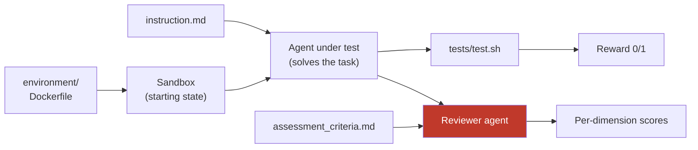

Before you let a skill scaffold one for you, it helps to understand what a benchmark *is*. It's a directory of plain files with three moving parts: **tasks** (the problems), **variants** (the agent configurations you compare), and **dimensions** (the axes you score on).

## The three moving parts

| Part | What it is | Where it lives |
|---|---|---|
| **Task** | One problem to solve, with a known-good answer | `tasks/<name>/` |
| **Variant** | One agent configuration under test | `variants/<name>/` |
| **Dimensions** | The scoring axes, shared across tasks | `assessment_dimensions.json` |

You author the tasks and dimensions once; you add variants as you have configurations to compare. Running every variant against every task gives you the comparison grid.

## What each task file does

A task is four files, and each one feeds a different stage of the run:

- **`instruction.md`** — what the agent is asked to do. Describe the *problem*, never the solution. (If you leak the diff, you're testing copying, not problem-solving.)
- **`environment/`** — the starting codebase, as a `Dockerfile` or auto-generated from `[nasde.source]`. Every trial begins here, identically.
- **`tests/test.sh`** — the deterministic verifier. It runs after the agent and writes `1` or `0` to the reward file.
- **`assessment_criteria.md`** — the per-task rubric the reviewer scores against (paired with the benchmark-wide `assessment_dimensions.json`).

See [Configuration](/nasde-toolkit/reference/configuration/) for the exact directory layout and file formats.

## You don't have to write it all by hand

The tedious parts — picking a good task, writing the Dockerfile, drafting criteria — are what the [authoring skills](/nasde-toolkit/getting-started/quick-start/#install-the-authoring-skills) automate:

- **`nasde-benchmark-creator`** — interactive end-to-end scaffolding.
- **`nasde-benchmark-from-history`** — turns a commit range or merged PR from *your* repo into a task (work your team already solved, so you know the answer).
- **`nasde-benchmark-from-public-repos`** — builds a diverse multi-repo suite for testing a universal skill.

The skills *propose*; you review every file before it's written. Understanding the anatomy above is what lets you review well. The one part worth writing thoughtfully yourself is the rubric — see [Assessment Criteria & Dimensions](/nasde-toolkit/creating-benchmarks/assessment-criteria/).
