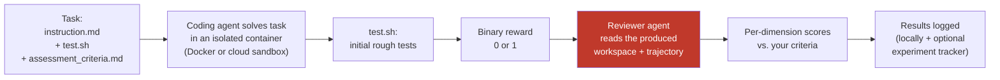

## Why NASDE? — the problem

Your team runs AI coding agents — but which setup is actually best for *your* codebase, and what is it costing you? Switch from Claude to Codex, swap a model, add a skill or an MCP server — and you're guessing whether quality went up, down, or just got more expensive.

The decisions that matter are getting expensive: **which provider, which model, which configuration** — each with a different quality-per-dollar trade-off. Without measurement, you're optimizing AI spend on gut feel.

NASDE measures your **whole harness** — the agent, its skills, its MCP servers, against *your* tasks — and reports not just **how good** the output is, but **how many tokens and how many dollars** it took, per model and per provider. That's the data behind a real decision: where to invest, which model to standardize on, and when a migration actually pays off.

It runs on your own machine with a subscription you already have, and you stay in control of what "good" means — you define the tasks and the criteria; NASDE runs the experiment the same way every time and puts quality and cost side by side.

## What NASDE does — in four steps

One `nasde run` command executes the whole chain.

1. **You describe a task you already understand.** An instruction, a repo snapshot, and the assessment criteria describing what a good solution looks like. The output can be anything the agent writes into its workspace — code, a migration plan, an ADR, a SQL script, updated docs.
2. **The agent solves it in a sandbox.** The agent works in a safe, isolated environment — it can't touch your machine or your real code. Every run starts from the same clean state, so different configurations get a fair comparison. When it's done, a quick `test.sh` check gives a rough pass/fail signal. Powered by [Harbor](https://www.harborframework.com/), runs locally on Docker or in the cloud.
3. **A reviewer agent assesses the result against your criteria.** After initial rough tests pass or fail, a second coding agent (`claude` or `codex`) navigates the workspace and scores your chosen dimensions (e.g. *domain modeling*, *test quality*) on whatever scale you picked. The review stays token-efficient even on large codebases.
4. **Results land in a dashboard (optional).** Browse scores, compare variants, and track how your agent setup evolves over time — optionally via [Opik](https://www.comet.com/site/products/opik/).

You're the one defining "what good looks like." NASDE just automates running the experiment and assessing it the same way every time.

## The evaluation pipeline, end to end

Stage 1 (the agent solving the task in a sandbox) comes from [Harbor](https://www.harborframework.com/); the optional tracking stage uses [Opik](https://github.com/comet-ml/opik). NASDE is the glue that connects them and adds the **reviewer stage** in between — the part that turns "did the test pass?" into "how good is the result, on the dimensions *I* care about?" See [How It Works](/nasde-toolkit/concepts/how-it-works/) for the two kinds of scoring and the full per-stage detail.

## Why this is useful — a concrete example

The value shows up the moment you compare configurations. Here are four agent setups scored against the *same* criteria on one real task (a DDD weather-discount feature):

| Variant | Pass | Domain (/25) | Tests (/20) | Total (/100) |
|---|:---:|:---:|:---:|:---:|
| `claude-vanilla` | 75% | 17.1 | 7.7 | **61.6** |
| `claude-guided` (with a DDD skill) | 75% | 17.4 | 8.7 | **65.1** |
| `codex-vanilla` | 89% | 18.8 | 8.7 | **69.4** |
| `codex-guided` (same skill) | 50% | 11.5 | 6.0 | **47.4** |

The same "DDD guidance" skill helps Claude a little (+3.5) and *badly* hurts Codex (−22) — an insight that's invisible without per-dimension assessment, and exactly what NASDE is built to surface. See [A Real Task](/nasde-toolkit/concepts/real-task-example/) for the full breakdown and [Benchmark Results](/nasde-toolkit/guides/benchmark-results/) for more.

## What NASDE is — and is not

It helps to be clear about the boundaries before you invest:

**NASDE is:**
- A way to **measure and compare agent configurations** (skills, `CLAUDE.md`, MCP, model, reasoning effort) on tasks you define.
- A **local, offline-friendly** tool — runs on your machine via Docker, billed through your existing `claude` / `codex` / `gemini` subscription or API key.
- A framework for **building your own benchmarks** from real work (e.g. your git history), with multi-dimensional LLM-as-a-Judge scoring.

**NASDE is not:**
- **A replacement for your CI or test suite.** The rough `test.sh` is a pass/fail gate, not a full test harness — it answers "did it work?", and the reviewer answers "how good is it?". Neither replaces your real tests.
- **A production monitor.** It scores agents on benchmark tasks in a sandbox, not live traffic.
- **A judge of the "one true model."** It surfaces trade-offs (quality vs. cost, per-dimension strengths) — *you* decide what wins for your budget and priorities.
- **Zero-setup or zero-cost.** It needs Docker and an agent you're authenticated to; each run spends real tokens.

### How NASDE drives the agents

NASDE runs every agent **non-interactively** — it scripts them rather than chatting with them, using each tool's programmatic mode (`claude -p`, `codex exec`, and the Gemini CLI equivalent) under the hood, for both the agent under test and the reviewer. An **interactive mode is planned** but not available yet.

Because it uses Claude programmatically, NASDE falls under Anthropic's terms for programmatic use. Anthropic has announced that, **from June 15, 2026, paid Claude plans include a dedicated monthly credit for programmatic usage** — covering `claude -p`, the Claude Agent SDK, and Claude Code GitHub Actions, among others. So running NASDE on a paid Claude subscription is expected and supported; check [Anthropic's current terms](https://www.anthropic.com/) for the exact credit and limits that apply to your plan.

### Agents and providers

**Today** NASDE drives **Claude Code, the Codex CLI, and the Gemini CLI** — so you can already compare across three providers on the same tasks, with quality and cost side by side. **Planned:** Pi, Cursor, and router-based setups — so a single benchmark spans every agent and router you're weighing, and a migration decision comes with full visibility into the quality-vs-cost trade-offs.

## What do I use it for?

The core use is a **cost-and-quality decision** about your AI coding stack: *which agent, which model, which provider, which configuration — for our codebase and our budget?* NASDE answers it with numbers instead of vibes.

Typical things you'd do with it:

- **Compare providers and models on quality *and* cost** — Claude Code vs. Codex vs. Gemini, Sonnet vs. Opus, against *your* tasks; see the score *and* the tokens and dollars each one spends, so you can pick the best quality-per-dollar for your budget.
- **Decide whether a migration pays off** — before standardizing on a new agent or model, measure what actually changes in output quality and in spend.
- **Measure your whole harness, not just one skill** — run your real `CLAUDE.md` + skills + MCP servers as a unit, and see how the full configuration performs, not just an isolated component.
- **Tune a single skill or config** — baseline vs. "with my new skill"; see whether it moves the score up or down, and on which dimensions.
- **Build a regression suite for your AI setup** — once a task set exists, re-run it every time someone tweaks the prompt/skills/MCP/model and catch quality *or* cost regressions before they ship.
- **Run agents safely on realistic tasks** — a sandboxed container means the agent can `rm -rf`, install random packages, or loop your tests without wrecking your laptop.

Ready to try it? Head to the [Quick Start](/nasde-toolkit/getting-started/quick-start/).
