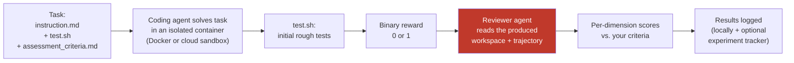

## What NASDE does — in four steps

One `nasde run` command executes the whole chain.

1. **You describe a task you already understand.** An instruction, a repo snapshot, and the assessment criteria describing what a good solution looks like. The output can be anything the agent writes into its workspace — code, a migration plan, an ADR, a SQL script, updated docs.
2. **The agent solves it in a sandbox.** The agent works in a safe, isolated environment — it can't touch your machine or your real code. Every run starts from the same clean state, so different configurations get a fair comparison. When it's done, a quick `test.sh` check gives a rough pass/fail signal. Powered by [Harbor](https://www.harborframework.com/), runs locally on Docker or in the cloud.
3. **A reviewer agent assesses the result against your criteria.** After initial rough tests pass or fail, a second coding agent (`claude` or `codex`) navigates the workspace and scores your chosen dimensions (e.g. *domain modeling*, *test quality*) on whatever scale you picked. The review stays token-efficient even on large codebases.
4. **Results land in a dashboard (optional).** Browse scores, compare variants, and track how your agent setup evolves over time — optionally via [Opik](https://www.comet.com/site/products/opik/).

You're the one defining "what good looks like." NASDE just automates running the experiment and assessing it the same way every time.

## The evaluation pipeline, end to end

Stage 1 (the agent solving the task in a sandbox) comes from [Harbor](https://www.harborframework.com/); the optional tracking stage uses [Opik](https://github.com/comet-ml/opik). NASDE is the glue that connects them and adds the **reviewer stage** in between — the part that turns "did the test pass?" into "how good is the result, on the dimensions *I* care about?" See [How It Works](/nasde-toolkit/concepts/how-it-works/) for the two kinds of scoring and the full per-stage detail.

## Why this is useful — a concrete example

The value shows up the moment you compare configurations. Here are four agent setups scored against the *same* criteria on one real task (a DDD weather-discount feature):

| Variant | Pass | Domain (/25) | Tests (/20) | Total (/100) |
|---|:---:|:---:|:---:|:---:|
| `claude-vanilla` | 75% | 17.1 | 7.7 | **61.6** |
| `claude-guided` (with a DDD skill) | 75% | 17.4 | 8.7 | **65.1** |
| `codex-vanilla` | 89% | 18.8 | 8.7 | **69.4** |
| `codex-guided` (same skill) | 50% | 11.5 | 6.0 | **47.4** |

The same "DDD guidance" skill helps Claude a little (+3.5) and *badly* hurts Codex (−22) — an insight that's invisible without per-dimension assessment, and exactly what NASDE is built to surface. See [A Real Task](/nasde-toolkit/concepts/real-task-example/) for the full breakdown and [Benchmark Results](/nasde-toolkit/guides/benchmark-results/) for more.

## What do I use it for?

Anyone working with AI coding agents eventually hits the same wall: *"I changed my skill / `CLAUDE.md` / MCP setup — is the agent actually better now, or does it just feel that way?"* NASDE turns that gut feeling into a repeatable measurement which is **easy to do on even on a personal machine, with a Claude Code or Codex subscription**.

Typical things you'd do with it:

- **Run an agent safely on a realistic task** — a sandboxed container means the agent can `rm -rf`, install random packages, or run your tests in loops without wrecking your laptop.
- **Compare two configurations of the same agent** — baseline vs. "with my new skill"; see whether the skill moves the score up or down, and on which dimensions.
- **Compare different agents on the same task** — Claude Code vs. Codex vs. Gemini CLI against *your* workspace and *your* criteria.
- **Build a regression suite for your AI setup** — once a task set exists, re-run it every time someone tweaks the prompt/skills/MCP and spot regressions before they ship.

Ready to try it? Head to the [Quick Start](/nasde-toolkit/getting-started/quick-start/).
