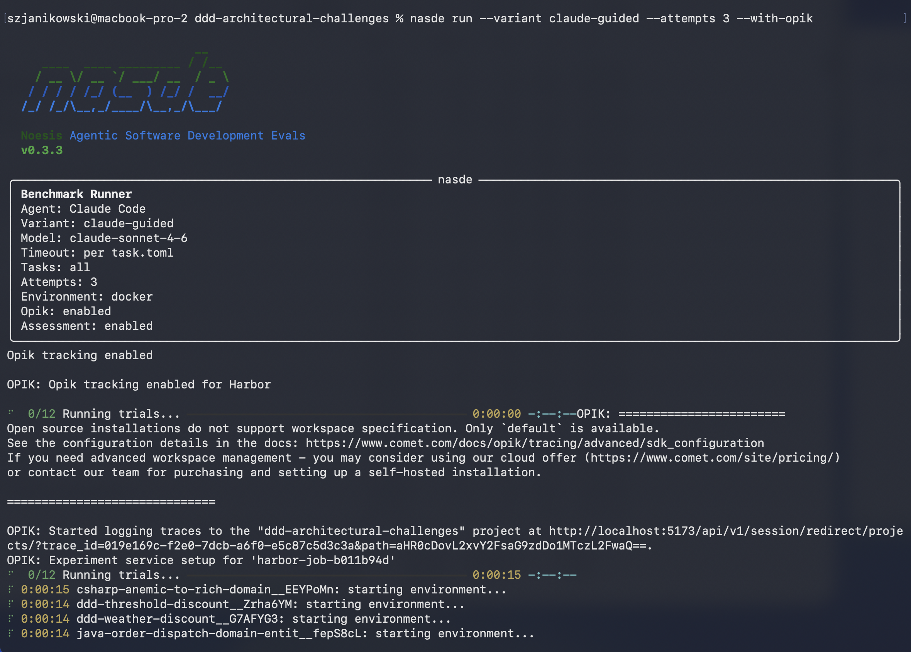

Your first `nasde run` finishes and prints a table, then writes a pile of files. Here's how to read both.

## The run summary table

At the end of a run, NASDE prints a per-configuration table — one row per `(agent, model, reasoning effort)` group:

<!-- TODO(image): nasde-run-summary.png — screenshot of the actual `nasde run` summary table (the per-(agent, model, effort) table with Trials, Score mean ±std, Tokens, Cost). Capture by running `nasde run --all-variants` on an example benchmark and screenshotting the terminal output. Drop into website/src/assets/benchmark/nasde-run-summary.png and add:
 -->

Read it like this:

- **Trials** — how many times that configuration ran. The sample size behind the mean.
- **Score** — the normalized quality (0–1) as `mean ±std`. The `±std` is the spread *between repeated runs* (the agent writes different code each time). A single run shows `mean (n=1)` rather than a fake `±0.00`.
- **Tokens / Cost** — total tokens and USD cost (see [Token & Cost](/nasde-toolkit/concepts/token-cost/)), with an inter-trial `±std` once a group has 2+ trials.

The headline question — *is configuration A better than B?* — is answered by comparing rows **and** their spreads: a 0.05 gap means little if each row wobbles by ±0.08.

## The `jobs/` directory

Every run writes a timestamped **job** folder under `jobs/` (gitignored). Inside, one folder per **trial** (`<task>__<id>/`), each containing:

| File | What it holds |
|---|---|
| `assessment_summary.json` | The representative result — per-dimension mean / std / range, plus economics |
| `assessment_eval_<N>.json` | Each individual reviewer pass (one per repetition) with full reasoning |
| `result.json` / `config.json` | The trial's reward, model, variant, and config |
| `agent/trajectory.json` | The agent's full tool-call trace |
| `logs/verifier/` | The rough-test output |

## Interpreting `assessment_summary.json`

This is the file you'll open most. It carries, per dimension, the `mean`, `std` (between repeated reviews of the *same* code — judge noise), `min`, and `max`, plus the normalized total and the token/cost economics. Two distinct noise sources live in different places, and keeping them apart is the point:

- **Agent noise** (the agent writes different code each run) → the `±std` in the run summary table, across trials.
- **Judge noise** (the reviewer scores the same code differently) → the per-trial `std` inside `assessment_summary.json`.

A gap you can trust is one that's larger than both.

## Beyond the local files

- **Opik dashboard** — run with `--with-opik` and the scores flow to an experiment tracker for browsing and cross-run comparison. See [Authentication & Opik](/nasde-toolkit/reference/authentication/#verifying-opik-results).
- **Export the essence** — `jobs/` is heavy and gitignored. [`nasde results-export`](/nasde-toolkit/guides/running-benchmarks/#exporting-results) copies just the scores, metrics, patch, and trajectory into any plain directory you want to keep.
- **Compare models visually** — the quality-vs-cost [Pareto frontier](/nasde-toolkit/concepts/token-cost/#quality-vs-cost-the-pareto-frontier) and per-dimension radars in [Benchmark Results](/nasde-toolkit/guides/benchmark-results/).
