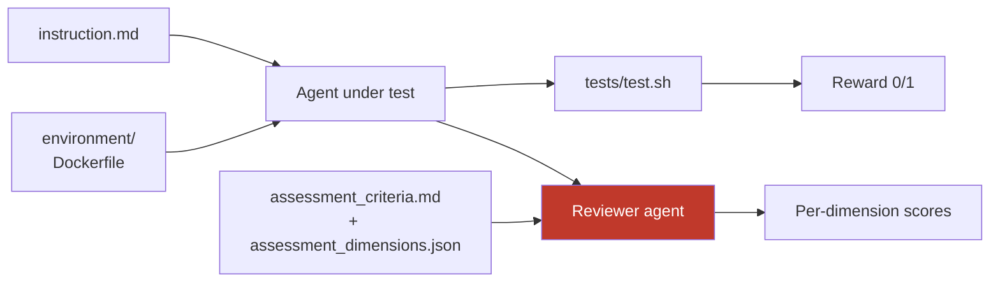

A benchmark is a directory of plain files. This page covers the layout and the three configuration files: `nasde.toml` (project), `variant.toml` (per agent configuration), and `task.toml` (per task).

## Quick reference: configuring a variant

For the impatient — a variant under test is a directory under `variants/<name>/` with:

- **`variant.toml`** *(required)* — agent type (`claude` / `codex` / `gemini`), model, optional `reasoning_effort`, optional `tasks` scope, optional `[[skill]]` references.
- **`CLAUDE.md`** / **`AGENTS.md`** / **`GEMINI.md`** — the agent's instructions (one file, matching the family).
- **`skills/`** *(optional)* — Claude Code skills copied in whole (Codex: `agents_skills/`, Gemini: `gemini_skills/`).

That's the whole agent-under-test surface. The walkthrough — what each knob is *for* — is in [Configuring the agent under test](/nasde-toolkit/guides/running-benchmarks/#configuring-the-agent-under-test); the formats are below.

## Project layout

```
my-benchmark/
  nasde.toml                  # Project configuration
  assessment_dimensions.json   # Scoring dimensions (shared across tasks)
  tasks/
    feature-a/
      task.toml                # Task config (Harbor sections + [nasde.source] / [nasde.plugin])
      instruction.md           # Agent prompt
      assessment_criteria.md   # Per-task criteria for post-hoc evaluator
      environment/             # Optional: custom Dockerfile (else auto-generated from [nasde.source] / [nasde.plugin])
      tests/
        test.sh                # Harbor verification script
  variants/
    vanilla/                   # Claude Code variant
      variant.toml             # agent = "claude", model = "claude-sonnet-4-6"
      CLAUDE.md                # Agent system prompt (injected to /app/CLAUDE.md)
    guided/                    # Claude Code variant with skills
      variant.toml             # may also list [[skill]] entries (skill-by-reference)
      CLAUDE.md
      skills/                  # Claude skills (injected to /app/.claude/skills/, incl. references/)
        my-skill/
          SKILL.md
    codex-baseline/            # Codex variant
      variant.toml             # agent = "codex", model = "gpt-5.3-codex"
      AGENTS.md                # Codex instructions (injected to /app/AGENTS.md)
    gemini-baseline/           # Gemini CLI variant
      variant.toml             # agent = "gemini", model = "google/gemini-3-flash-preview"
      GEMINI.md                # Gemini instructions (injected to /app/GEMINI.md)
  evaluator_skills/            # Optional: skills for the evaluator agent
    code-review/
      SKILL.md
  evaluator_mcp.json           # Optional: MCP server config for evaluator
  jobs/                        # Trial output (gitignored)
```

Each agent family injects its instructions differently: Claude Code variants get `CLAUDE.md` → `/app/CLAUDE.md`, Codex variants `AGENTS.md` → `/app/AGENTS.md`, Gemini variants `GEMINI.md` → `/app/GEMINI.md`. Codex/Gemini skills live under `agents_skills/` and `gemini_skills/` respectively.

### What each task file does

Each file in a task feeds a different stage of the run:



See [Anatomy of a Benchmark](/nasde-toolkit/creating-benchmarks/anatomy/) for the conceptual walkthrough.

## `nasde.toml`

Project-level configuration: defaults, the Docker base, and the reviewer (`[evaluation]`).

```toml
[project]
name = "my-benchmark"
version = "1.0.0"

[defaults]
variant = "vanilla"
# harbor_env = "daytona"  # Optional: cloud sandbox provider (default: docker)

[docker]
base_image = "ubuntu:22.04"
build_commands = []

[evaluation]
backend = "claude"                            # "claude" (default) | "codex"
model = "claude-opus-4-7"
dimensions_file = "assessment_dimensions.json"
# eval_repetitions = 3                        # Judge evaluations per trial (default 3)
# max_turns = 60                              # Max evaluator conversation turns (default 60)
# allowed_tools = ["Read", "Glob", "Grep"]    # Override default tool whitelist
# mcp_config = "./evaluator_mcp.json"         # MCP server config for evaluator
# skills_dir = "./evaluator_skills"           # Skills directory for evaluator
# append_system_prompt = ""                   # Extra system prompt for evaluator
# include_trajectory = false                   # Include ATIF trajectory in evaluation

[reporting]
platform = "opik"
project_name = "my-benchmark"                 # Opik project name (defaults to [project] name)
```

The `[evaluation]` block is the reviewer agent's configuration — see [Configuring the Reviewer Agent](/nasde-toolkit/guides/running-benchmarks/#configuring-the-reviewer-agent) for what each option does.

## `variant.toml`

Every variant directory must contain a `variant.toml` declaring the agent type **and** the model:

```toml
agent = "claude"                   # "claude" | "codex" | "gemini"
model = "claude-sonnet-4-6"        # model appropriate for the agent family
reasoning_effort = "high"          # optional — see Reasoning effort below
```

If no `harbor_config.json` exists, one is auto-generated from the agent type.

### Reasoning effort

How hard the model thinks is a configuration you should set deliberately, not leave to chance. Each agent family ships a *different* default level, and those defaults are not comparable — Codex's `high` is the top of its three levels, while Claude's `high` is only the middle of five (`xhigh` and `max` sit above it). Comparing two agents on their respective defaults silently compares different thinking budgets.

Set the effort explicitly with the optional `reasoning_effort` field in `variant.toml`, or override it for a single run with `nasde run --effort`. Priority is **`--effort` > `variant.toml reasoning_effort` > Harbor's family default** (left unset means NASDE passes nothing and the family default applies). Typical levels (for reference — the exact set differs per model and changes over time): Claude `low`/`medium`/`high`/`xhigh`/`max`, Codex `none`/`minimal`/`low`/`medium`/`high`/`xhigh`, Gemini `minimal`/`low`/`medium`/`high`. NASDE does **not** police the value — it passes whatever you set straight to the agent, which is the source of truth and rejects an unknown level itself; this avoids a stale built-in list wrongly blocking a newly-valid level.

The effort you set is stamped onto each trial (`reasoning_effort` in `assessment_summary.json` and `metrics.json`), and the `nasde run` cost table groups by `(agent, model, effort)` — a different effort is treated as a different configuration and never averaged in with another.

### Skill-by-reference (`[[skill]]`) and task scoping (`tasks`)

A variant can reference a skill by its source path instead of copying it in, and can be scoped to specific tasks. Both are covered with examples in [Plugins & Skills](/nasde-toolkit/guides/plugins-and-skills/):

```toml
agent = "claude"
model = "claude-sonnet-4-6"

tasks = ["csharp-anemic-to-rich-domain"]   # optional: restrict this variant to specific tasks

[[skill]]                                   # optional: stage a skill from its source path
path = "../../../src/plugins/my-plugin/skills/my-skill"
ref  = "abc1234"
```

## `task.toml`

A single task config file, shared with Harbor — it reads its standard sections (`[task]`, `[agent]`, `[environment]`, `[verifier]`, `[metadata]`) directly. NASDE-specific fields live under `[nasde.*]` and are ignored by Harbor.

### Local repo source (`[nasde.source]`)

Build benchmarks from local (private) repositories by adding `[nasde.source]` to `task.toml` — NASDE auto-generates the Docker environment, no custom `Dockerfile` needed:

```toml
[nasde.source]
git = "../.."
ref = "abc1234"
```

### Plugin source (`[nasde.plugin]`)

Ship a local Claude Code plugin (skills + MCP server) into the sandbox with one declaration. Full walkthrough in [Plugins & Skills](/nasde-toolkit/guides/plugins-and-skills/#benchmarking-a-plugin-nasdeplugin):

```toml
[nasde.plugin]
path = "../../../src/plugins/my-plugin"   # dir containing .claude-plugin/plugin.json
ref = "abc1234"                           # optional git ref
install_root = "/opt/my-plugin"           # optional, default /opt/<plugin-name>
build = "bun install --frozen-lockfile"   # optional, run at image-build time

[nasde.plugin.env]                        # optional, exported in the MCP server wrapper
CLAUDE_PLUGIN_DATA = "/opt/my-plugin-data"
```
